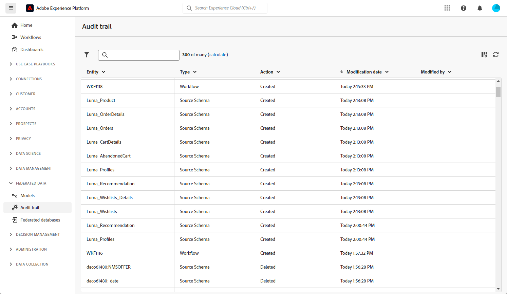

# Trilha de auditoria {#audit-trail}

>[!AVAILABILITY]
>
>Para acessar a trilha de auditoria, você precisará da seguinte permissão:
>
>-**Exibir Trilha de Auditoria**
>
>Para mais informações sobre as permissões exigidas, leia o [guia de controle de acesso](/help/governance-privacy-security/access-control.md).

>[!CONTEXTUALHELP]
>id="dc_audit_trail"
>title="Trilha de auditoria"
>abstract="O recurso Trilha de auditoria fornece um registro detalhado e cronológico de todas as ações e eventos que foram realizados no seu ambiente de composição de público-alvo federado da Adobe Experience Platform em tempo real."

O recurso **[!UICONTROL Trilha de auditoria]** registra constantemente um log detalhado de ações e eventos que ocorrem na instância do Adobe Federated Composition em tempo real. Ele oferece um método conveniente para acessar um registro cronológico de dados, abordando queries como: o status dos workflows, os indivíduos mais recentes para modificá-los ou as atividades executadas pelos usuários na instância.

+++ Saiba mais sobre entidades disponíveis de Trilha de auditoria

* **A trilha de auditoria do esquema do Source** permite monitorar atividades e modificações recentes feitas em seus esquemas na instância do Adobe Federated Audience Composition.

  Para obter informações detalhadas sobre esquemas, consulte esta [página](../data-modelling/schemas.md).

* A **trilha de auditoria do fluxo de trabalho** permite acompanhar atividades e alterações recentes feitas nos fluxos de trabalho, incluindo seus estados atuais, como:

   * Start
   * Pause
   * Parar
   * Restart
   * Limpeza que é igual ao histórico de Expurgação da ação
   * Simular qual é igual ao Início da ação no modo de simulação
   * Ativar que é igual à ação Executar tarefas pendentes agora
   * Interrupção incondicional

  Para obter mais informações sobre fluxos de trabalho, consulte esta [página](../compositions/home.md).

* **Conta externa** permite verificar as modificações feitas em contas externas na instância do Adobe Audience Composition.

  Para obter mais informações sobre a conta externa, consulte esta [página](../connections/home.md).

+++

## Acessando a Trilha de auditoria {#accessing-audit-trail}

Para acessar a **[!UICONTROL Trilha de auditoria]** da sua instância:

1. No menu **[!UICONTROL Dados federados]**, selecione **[!UICONTROL Trilha de auditoria]**.

1. A janela **[!UICONTROL Trilha de auditoria]** é aberta com a lista de suas entidades. A Composição de público-alvo federado audita as ações de criação, edição e exclusão de workflows, opções, deliveries e esquemas.

   

1. A janela **[!UICONTROL Entidade de auditoria]** fornece informações mais detalhadas sobre a entidade escolhida, como:

   * **[!UICONTROL Tipo]**: Fluxo de Trabalho, Opções, Entregas ou Esquemas.
   * **[!UICONTROL Entidade]**: nome interno de suas atividades.
   * **[!UICONTROL Modificado por]**: nome de usuário da última pessoa que modificou esta entidade pela última vez.
   * **[!UICONTROL Ação]**: última ação executada nesta entidade, Criada, Modificada ou Excluída.
   * **[!UICONTROL Data de modificação]**: data da última ação executada nesta entidade.
