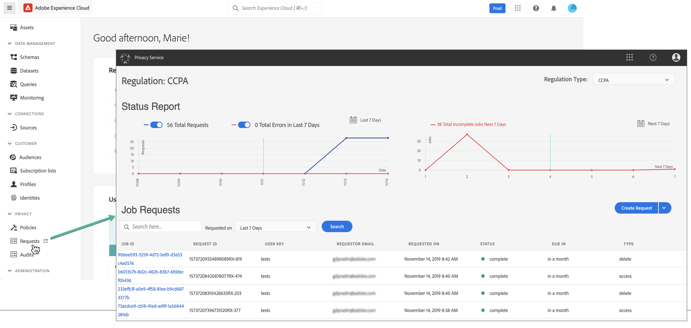
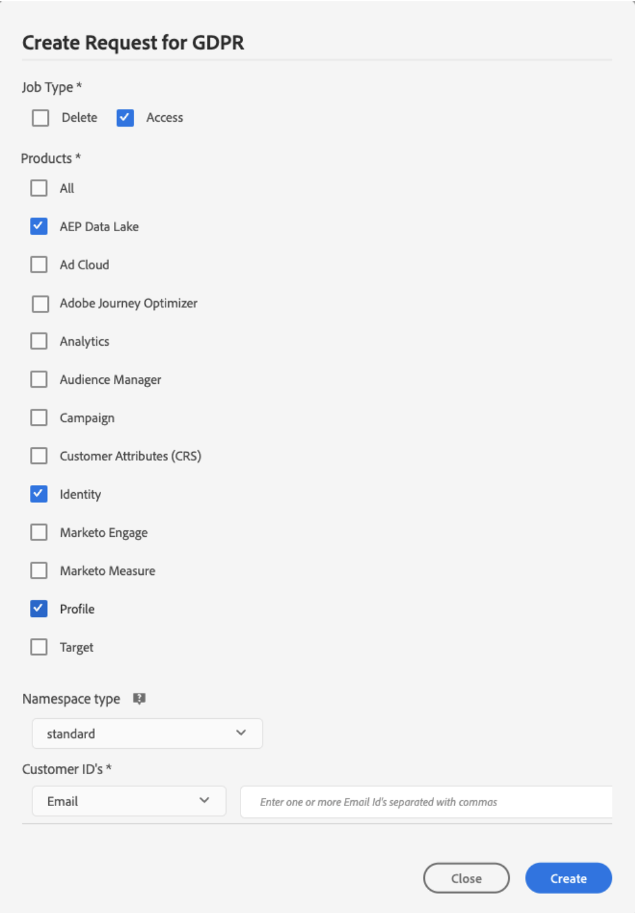

# Solicitações de privacidade {#privacy-requests}

Depois de criar uma composição, os públicos-alvo resultantes são salvos na Adobe Experience Platform.

Você pode fazer solicitações de privacidade para acessar e/ou excluir dados do perfil correspondentes a esses públicos por meio da **Privacy Service** da Adobe Experience Platform, que fornece uma [interface de usuário](https://experienceleague.adobe.com/docs/experience-platform/privacy/ui/user-guide.html?lang=pt-BR){target="_blank"} e uma [API RESTful](https://experienceleague.adobe.com/pt-br/docs/experience-platform/privacy/api/overview){target="_blank"} para ajudar você a gerenciar solicitações de dados do cliente.

<!--With Privacy Service, you can submit requests to access and delete personal customer data from Adobe Experience Cloud applications, facilitating automated compliance with legal and organizational privacy regulations.

Privacy requests can be created and managed from the **[!UICONTROL Requests]** menu.

-->

>[!NOTE]
>
>Para obter mais informações sobre o Privacy Service, consulte a [documentação do Adobe Experience Platform](https://experienceleague.adobe.com/docs/experience-platform/privacy/home.html?lang=pt-BR){target="_blank"}.

Você pode criar e gerenciar solicitações individuais para acessar e excluir dados do cliente da Composição de público-alvo federado da Adobe. As etapas para enviar **solicitações de acesso** e **solicitações de exclusão** estão detalhadas na [documentação de Perfil do cliente em tempo real](https://experienceleague.adobe.com/pt-br/docs/experience-platform/profile/privacy){target="_blank"}.

<!--## Manage individual data privacy requests {#data-privacy-requests}

You can submit individual requests to access and delete consumer data from Adobe Federated Audience Composition in two ways:

* Through the **Privacy Service UI**. [Learn more](https://experienceleague.adobe.com/docs/experience-platform/privacy/ui/user-guide.html?lang=pt-BR){target="_blank"}
* Through the **Privacy Service API**. [Learn more](https://experienceleague.adobe.com/pt-br/docs/experience-platform/privacy/api/overview){target="_blank"}

///More specific information on Privacy Service API [here](https://developer.adobe.com/experience-platform-apis/references/privacy-service/#_blank).

Privacy Service supports two types of requests: **data access** and **data deletion**.

For **access requests** and **delete requests**, specify the three following services from the UI:

* Profile (product code: "profileService" in the API)
* AEP Data Lake (product code: "aepDataLake" in the API)
* Identity (product code: "identity" in the API)

## Create Access and Delete requests

### Prerequisites

To make requests to Access and Delete data for Adobe Federated Audience Composition, you must have:

* an Adobe organization ID
* an Identity identifier of the person you want to act on and the corresponding namespace(s). For more information about identity namespaces Experience Platform, see the [identity namespace overview](https://experienceleague.adobe.com/pt-br/docs/experience-platform/identity/features/namespaces).

### Required field values for API requests

```json
"companyContexts":
    "namespace": imsOrgID
    "value": <Your Adobe Organization ID Value>

"users":
    "action": either access or delete

    "userIDs":
        "namespace": e.g. email, aaid, ecid, etc.
        "type": standard
        "value": <Data Subject's Identity Identifier>

"include":
    profileService (product code for Profile)
    aepDataLake (product code for AEP Data Lake)
    identity (product code for Identity)

"regulation":
    gdpr, ccpa, pdpa, lgpd_bra, or nzpa_nzl (which is the privacy regulation that applies to the request)
```


### GDPR Access request example

From the UI:

{width="60%" align="center"}

Through the API:

```json
// JSON Request
{
   "companyContexts":[
      {
         "namespace":"imsOrgID",
         "value":"745F37C35E4B776E0A49421B@AdobeOrg"
      }
   ],
   "users":[
      {
         "action":[
            "access"
         ],
         "userIDs":[
            {
               "namespace":"ecid",
               "value":"38400000-8cf0-11bd-b23e-10b96e40000d",
               "type":"standard"
            },
            {
               "namespace":"email",
               "value":"johndoe4@gmail.com",
               "type":"standard"
            }
         ]
      }
   ],
   "include":[
    "profileService", "aepDataLake", "identity"
   ],
   "regulation":"gdpr"
}
```

```json
// JSON Response
{
    "requestId": "17163122360480365RX-705",
    "totalRecords": 1,
    "jobs": [
        {
            "jobId": "e709b1f4-1796-11ef-b422-eddd0aebc40d",
            "customer": {
                "user": {
                    "key": "John Doe",
                    "action": [
                        "access"
                    ],
                    "userIDs": [
                        {
                            "namespace": "ecid",
                            "value": "38400000-8cf0-11bd-b23e-10b96e40000d",
                            "type": "standard",
                            "namespaceId": 4,
                            "isDeletedClientSide": false
                        },
                        {
                            "namespace": "email",
                            "value": "johndoe4@gmail.com",
                            "type": "standard",
                            "namespaceId": 6,
                            "isDeletedClientSide": false
                        }
                    ]
                }
            }
        }
    ]
}
```

### GDPR Delete request example

From the UI:

{width="60%" align="center"}

Through the API:

```json
// JSON Request
{
  "companyContexts": [
    {
      "namespace": "imsOrgID",
      "value": "745F37C35E4B776E0A49421B@AdobeOrg"
    }
  ],
  "users": [
    {
      "action": [
          "delete"
      ],
      "userIDs": [
        {
          "namespace": "ecid",
          "value": "38400000-8cf0-11bd-b23e-10b96e40000d",
          "type": "standard"
        },
                {
          "namespace": "email",
          "value": "johndoe4@gmail.com",
          "type": "standard"
        }
      ]
    }
  ],
  "include": [
    "profileService", "aepDataLake", "identity"
  ],
  "regulation": "gdpr"
}
```

```json
// JSON Response
{
    "requestId": "17163122360480365RX-705",
    "totalRecords": 1,
    "jobs": [
        {
            "jobId": "e709b1f4-1796-11ef-b422-eddd0aebc40d",
            "customer": {
                "user": {
                    "key": "John Doe",
                    "action": [
                        "delete"
                    ],
                    "userIDs": [
                        {
                            "namespace": "ecid",
                            "value": "38400000-8cf0-11bd-b23e-10b96e40000d",
                            "type": "standard",
                            "namespaceId": 4,
                            "isDeletedClientSide": false
                        },
                        {
                            "namespace": "email",
                            "value": "johndoe4@gmail.com",
                            "type": "standard",
                            "namespaceId": 6,
                            "isDeletedClientSide": false
                        }
                    ]
                }
            }
        }
    ]
}
```
-->