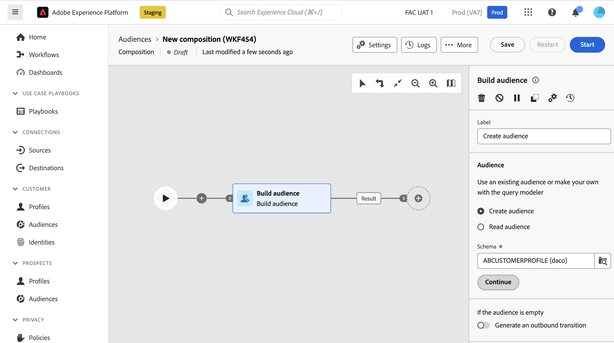
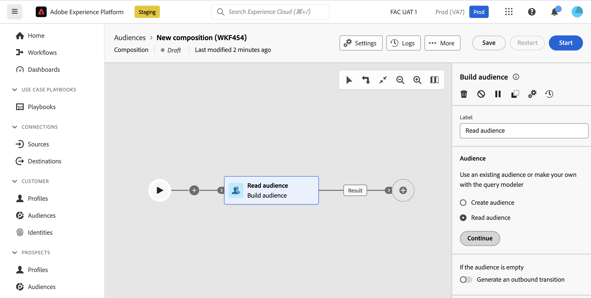

# Criar público-alvo {#build-audience}

>[!CONTEXTUALHELP]
>id="dc_orchestration_build_audience"
>title="Atividade Criar público-alvo"
>abstract="A atividade **Criar público-alvo** permite definir o público-alvo que entrará na composição."

A atividade **Criar público-alvo** permite definir o público-alvo que entrará na composição. Para definir o público-alvo, você pode:

* Selecione um público existente do Adobe Experience Platform.
* Crie um novo público-alvo com o modelador de consultas definindo e combinando critérios de filtragem.

## Configurar a atividade Criar público-alvo {#build-audience-configuration}

>[!CONTEXTUALHELP]
>id="dc_orchestration_build_audience_audienceselector"
>title="Público-alvo"
>abstract="Selecione o público-alvo."

Siga estas etapas para configurar a atividade **Criar público-alvo**:

1. Adicione uma atividade **Criar público-alvo**.
1. Defina um rótulo.
1. Especifique se deseja criar um público-alvo ou selecione um existente.
1. Configure seu público seguindo as etapas detalhadas nas guias abaixo.

>[!BEGINTABS]

>[!TAB Criar público-alvo]

Para criar seu próprio público-alvo, siga estas etapas:

1. Selecione **Criar audiência**.
1. Escolha o **Esquema**, também conhecido como targeting dimension. O schema permite definir o público alvo da operação: recipients, beneficiários de contrato, operadores, assinantes, etc. Por padrão, o schema é selecionado dos recipients.

   

1. Clique em **Continuar**.
1. Use o modelador de consultas para definir a consulta e, em seguida, confirme. [Saiba como trabalhar com o modelador de consultas](../../query/query-modeler-overview.md)

>[!TAB Ler público-alvo]

Para selecionar um público-alvo existente, siga estas etapas:

1. Selecione **Ler público-alvo**.
1. Clique em **Continuar**.

   

1. Selecione o público-alvo.

>[!ENDTABS]

>[!NOTE]
>
>A opção **Generate an outbound transition** permite adicionar uma transição de saída que será ativada no final da execução da atividade se a população do público-alvo estiver vazia.

<!--
## Examples{#build-audience-examples}

Here is an example of a workflow with two **Build audience** activities. The first one targets the poker players audience, followed by an email delivery. The second one targets the VIP clients audience, followed by an SMS delivery.

-->
