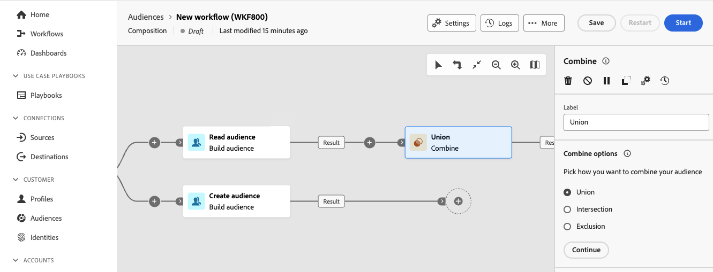

# Combinar {#combine}

>[!CONTEXTUALHELP]
>id="dc_orchestration_combine"
>title="Atividade de combinar"
>abstract="A atividade **Combinar** permite executar a segmentação na população de entrada. Dessa forma, é possível combinar várias populações, excluir uma parte delas ou manter apenas dados comuns a vários públicos-alvo."

A atividade **Combinar** permite executar a segmentação na população de entrada. Dessa forma, é possível combinar várias populações, excluir parte delas ou manter apenas dados comuns a vários targets.

A variável **Combinar** A atividade pode ser colocada após qualquer outra atividade, mas não no início da composição. Qualquer atividade pode ser colocada após a variável **Combinar**.

## Configurar a atividade Combinar {#combine-configuration}

>[!CONTEXTUALHELP]
>id="dc_orchestration_intersection_merging_options"
>title="Opções de mesclagem de interseção"
>abstract="A **interseção** permite manter somente os elementos comuns às diferentes populações de entrada na atividade. Na seção **Conjuntos para unir**, marque todas as atividades anteriores que deseja unir."

>[!CONTEXTUALHELP]
>id="dc_orchestration_exclusion_merging_options"
>title="Opções de mesclagem de exclusão"
>abstract="A **Exclusão** permite excluir elementos de uma população de acordo com determinados critérios. Na seção **Conjuntos para unir**, marque todas as atividades anteriores que deseja unir."

>[!CONTEXTUALHELP]
>id="dc_orchestration_combine_options"
>title="Selecione o tipo de segmentação"
>abstract="Selecione como combinar públicos-alvo: união, intersecção ou exclusão."

Siga estas etapas comuns para começar a configurar a atividade **Combinar**:

1. Adicione várias atividades para formar pelo menos duas ramificações de execução diferentes.

1. Adicione uma atividade **Combinar** a qualquer uma das ramificações anteriores.

1. Selecione o tipo de segmentação: [União](#union), [Interseção](#intersection) ou [Exclusão](#exclusion)e clique em **Continuar**.

   

1. No **Conjuntos para ingressar** marque todas as atividades anteriores que deseja participar.

## União {#combine-union}

>[!CONTEXTUALHELP]
>id="dc_orchestration_intersection_reconciliation_options"
>title="Opções de reconciliação de interseção"
>abstract="Selecione o tipo de reconciliação para definir como as duplicatas são tratadas."

>[!CONTEXTUALHELP]
>id="dc_orchestration_combine_reconciliation"
>title="Opções de reconciliação"
>abstract="Selecione o **Tipo de reconciliação** para definir como lidar com duplicatas."

No **Combinar** atividade, você pode configurar um **União**.

Para isso, é necessário selecionar o **Tipo de reconciliação** para definir como as duplicatas são tratadas:

* **Somente chaves**: este é o modo padrão. A atividade só mantém um elemento quando elementos de transições de entrada diferentes têm a mesma chave. Essa opção só poderá ser usada se as populações de entrada forem homogêneas.
* **Uma seleção de colunas**: selecione esta opção para definir a lista de colunas em que a reconciliação de dados é aplicada. Primeiro, selecione o conjunto principal (que contém os dados de origem) e, em seguida, as colunas a serem usadas para a união.

## Interseção {#combine-intersection}

No **Combinar** atividade, você pode configurar um **Interseção**.

Para isso, siga as etapas adicionais abaixo:

1. Selecione o **Tipo de reconciliação** para definir como as duplicatas são tratadas. Consulte a seção [União](#union).
1. Você pode verificar o **Gerar complemento** opção se desejar processar o público restante. O complemento conterá a união dos resultados de todas as atividades de entrada menos a intersecção. Será adicionada uma transição de saída adicional à atividade.

## Exclusão {#combine-exclusion}

>[!CONTEXTUALHELP]
>id="dc_orchestration_exclusion_options"
>title="Regras de exclusão"
>abstract="Quando necessário, é possível manipular tabelas de entrada. De fato, para excluir um target de outro schema, também conhecido como targeting dimension, esse target deve ser retornado para o mesmo schema que o target principal. Para fazer isso, clique em **Adicionar uma regra** na E **regras de exclusão** e especifique as condições de alteração do schema. A reconciliação de dados é realizada por meio de um atributo ou de uma união."

>[!CONTEXTUALHELP]
>id="dc_orchestration_combine_sets"
>title="Selecionar conjuntos a serem combinados"
>abstract="Na seção **Conjuntos para unir**, selecione o **Conjunto principal** das transições de entrada. Esse é o conjunto a partir do qual os elementos são excluídos. Os outros conjuntos correspondem a elementos antes de serem excluídos do conjunto principal."

>[!CONTEXTUALHELP]
>id="dc_orchestration_combine_exclusion"
>title="Regras de exclusão"
>abstract="Quando necessário, é possível manipular tabelas de entrada. De fato, para excluir um target de outro schema, também conhecido como targeting dimension, esse target deve ser retornado para o mesmo schema que o target principal. Para fazer isso, clique em **Adicionar uma regra** no **Regras de exclusão** e especifique as condições de alteração do schema. A reconciliação de dados é realizada por meio de um atributo ou de uma união."

>[!CONTEXTUALHELP]
>id="dc_orchestration_combine_complement"
>title="Combinar e gerar complemento"
>abstract="Ative a opção **Gerar complemento** para processar a população restante em uma transição adicional."

No **Combinar** atividade, você pode configurar um **Exclusão**.

Para isso, você precisa seguir as etapas adicionais abaixo:

1. Na seção **Conjuntos para unir**, selecione o **Conjunto principal** das transições de entrada. Esse é o conjunto a partir do qual os elementos são excluídos. Os outros conjuntos correspondem a elementos antes de serem excluídos do conjunto principal.

1. Quando necessário, é possível manipular tabelas de entrada. De fato, para excluir um target de outro schema, esse target deve ser retornado para o mesmo schema como o target principal. Para fazer isso, clique em **Adicionar uma regra** no **Regras de exclusão** e especifique as condições de alteração do schema. A reconciliação de dados é realizada por meio de um atributo ou uma junção. <!-- pas compris-->
1. Marque a opção **Gerar complemento** se desejar processar a população restante. Consulte a seção [Interseção](#intersection).

<!--
## Examples{#combine-examples}

In the following example, we are using a **Combine** activity and we add a **union** to retrieves all the profiles of the two queries: persons between 18 and 27 years old and persons between 34 and 40 years old.

The following example shows the **intersection** between two query activities. It is being used here to retrieve profiles who are between 18 to 27 years old and whose email address has been provided.

The following **exclusion** example shows two queries configured to filter profiles who are between 18 and 27 years old and have an Adobe email domain. The profiles with an Adobe email domain are then excluded from the first set. 

-->
