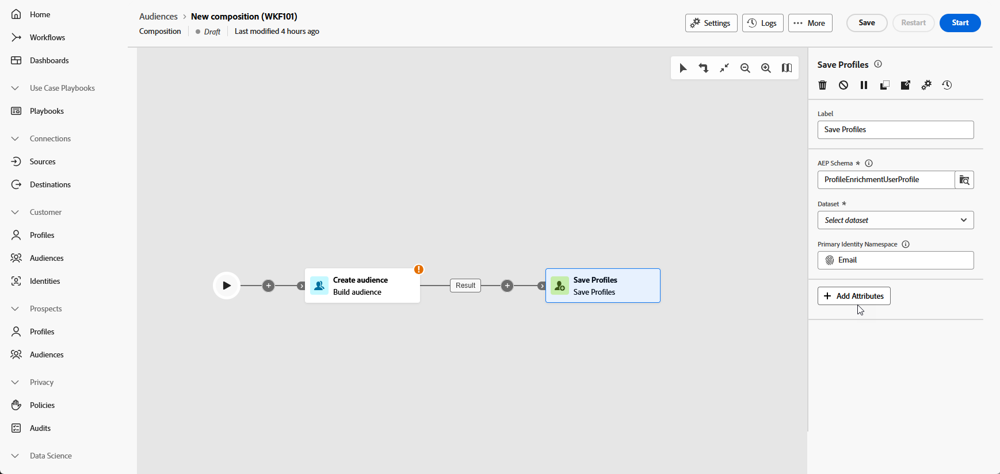

# Salvar perfis {#save-profile}

>[!CONTEXTUALHELP]
>id="dc_orchestration_saveprofile"
>title="Salvar perfis"
>abstract="A atividade Salvar perfis permite enriquecer perfis da Experience Platform federando dados de depósitos externos, permitindo aprimorar os perfis do cliente com atributos adicionais. "

>[!CONTEXTUALHELP]
>id="dc_orchestration_saveprofile_aepschemalist"
>title="Selecionar esquema do Experience Platform"
>abstract="Escolha o esquema da Experience Platform para os perfis."

>[!CONTEXTUALHELP]
>id="dc_orchestration_saveprofile_primaryidentitynamespace"
>title="Selecione o campo de identificação principal"
>abstract="Selecione a Identidade principal a ser usada para identificar os perfis direcionados no banco de dados."

>[!CONTEXTUALHELP]
>id="dc_orchestration_saveprofile_selectaepschema"
>title="Selecionar esquema do Experience Platform"
>abstract="Escolha o esquema da Experience Platform para os perfis."

>[!CONTEXTUALHELP]
>id="dc_orchestration_saveprofile_updatemode"
>title="Salvar modo de atualização do perfil"
>abstract="Os modos de atualização disponíveis para a atividade Salvar perfil incluem Atualização completa e Atualização incremental."

>[!CONTEXTUALHELP]
>id="dc_orchestration_saveprofile_updatemode_full"
>title="Atualização completa"
>abstract="O modo de atualização completa atualiza o conjunto completo de perfis para enriquecimento."

>[!CONTEXTUALHELP]
>id="dc_orchestration_saveprofile_updatemode_incremental"
>title="Atualização incremental"
>abstract="O modo de atualização incremental atualiza os perfis que foram modificados desde a última execução do enriquecimento."

>[!CONTEXTUALHELP]
>id="dc_orchestration_saveprofile_primaryidentityfield"
>title="Campo de identidade principal"
>abstract="O campo de identidade principal indica a fonte da verdade ao mesclar perfis para o enriquecimento."

>[!CONTEXTUALHELP]
>id="dc_orchestration_saveprofile_requiredfieldscheck"
>title="Critérios de campos obrigatórios"
>abstract="Um campo obrigatório é um atributo que deve ser preenchido para cada perfil ou registro ao exportar dados. Se um campo obrigatório estiver ausente, a exportação não será concluída ou válida."

>[!CONTEXTUALHELP]
>id="dc_orchestration_saveprofile_primaryidentitycheck"
>title="Critérios do campo de identidade principal"
>abstract="O identificador exclusivo de cada perfil ou registro. Isso garante que cada registro possa ser distintamente reconhecido e correspondido, evitando a duplicação de dados."

A atividade **Salvar perfis** permite enriquecer perfis do Adobe Experience Platform com dados federados de depósitos externos.

Normalmente, essa atividade é usada para aprimorar os perfis do cliente, trazendo atributos e insights adicionais sem mover fisicamente ou duplicar os dados na plataforma.

## Configurar a atividade Salvar perfis {#save-profile-configuration}

Siga estas etapas para configurar a atividade **Salvar perfis**:

1. Adicione uma atividade **Salvar perfis** à sua composição.

   

1. Especifique o rótulo dos perfis que serão criados.

   >[!IMPORTANT]
   >
   >O rótulo do público-alvo deve ser exclusivo na sandbox atual. Ele não pode ser o mesmo rótulo de nenhum público existente.

1. Selecione o esquema do Adobe Experience Platform que deseja usar.

   

1. Escolha o campo de identidade principal que será usado para identificar perfis no banco de dados.

1. Para reconciliar atributos de dados adicionais, clique em **Adicionar atributos**.

   Em seguida, especifique o campo **Source** (dados externos) e o campo **Destination** (campo de esquema) para cada atributo que deseja mapear.

   

1. Depois de configurado, clique em **Iniciar**.
