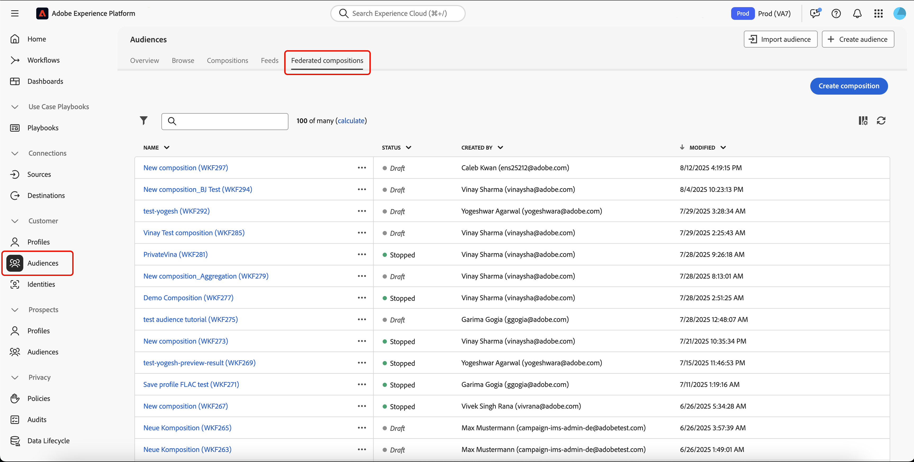

# Criar uma composição

A Composição de público-alvo federado permite criar composições, onde é possível aproveitar várias atividades em uma tela visual para criar públicos-alvo. Após criar a composição, os públicos-alvo resultantes são salvos na Adobe Experience Platform e podem ser aproveitados nos destinos da Experience Platform e no Adobe Journey Optimizer para o direcionamento de clientes.

## Definir sua composição {#create}

>[!CONTEXTUALHELP]
>id="dc_composition_creation_properties"
>title="Propriedades da composição"
>abstract="Nesta tela, escolha o modelo a ser usado para criar a composição e especifique um rótulo. Expanda a seção OPÇÕES ADICIONAIS para definir mais configurações, como o nome interno da composição, sua pasta, fuso horário e grupo supervisor. É altamente recomendável selecionar um grupo supervisor para que, se ocorrer um erro, os operadores sejam alertados."

Para criar uma composição, primeiro você precisará definir seu rótulo e, opcionalmente, definir configurações adicionais.

Para criar uma composição, selecione **[!UICONTROL Públicos-alvo]** na seção **[!UICONTROL Cliente]**, seguido da guia **[!UICONTROL Composições federadas]**.

A página de navegação das composições federadas é exibida. Selecione **[!UICONTROL Criar composição]** para continuar com o processo de criação de composição.

Na seção **[!UICONTROL Propriedades]**, especifique um rótulo para a composição e selecione um modelo de dados. Somente os esquemas associados a esse modelo de dados estarão disponíveis nas atividades de sua composição.

Selecione **[!UICONTROL Criar]**. A tela de composição é exibida. Agora você pode configurar sua composição adicionando atividades e transições à tela.

## Tela de composição {#canvas}

Na parte superior da tela, você pode acessar uma barra de ferramentas que fornece opções para gerenciar e navegar pelas suas atividades.

As opções disponíveis incluem:

* **[!UICONTROL Seleção múltipla]**: selecione várias atividades para excluí-las todas de uma vez ou copie-as e cole-as.
* **[!UICONTROL Girar]**: Alternar a tela para exibição vertical.
* **[!UICONTROL Ajustar à tela]**: ajuste o nível de zoom da tela de desenho à sua tela.
* **[!UICONTROL Mais zoom]** / **[!UICONTROL Menos zoom]**: mais zoom ou menos zoom na tela.
* **[!UICONTROL Exibir mapa]**: abre um instantâneo da tela mostrando que você está localizado.

## Adicionar atividades {#add-activities}

Na tela de composição, é possível adicionar atividades e transições que ajudam a definir seu público-alvo. As atividades permitem *definir* os componentes dentro do público-alvo, enquanto as transições permitem *organizar* o fluxo da sua composição.

Para obter mais informações sobre as atividades e transições disponíveis para uso, leia a [visão geral das atividades](./activities.md).

## Gerenciar atividades {#manage-activities}

Você pode executar operações em suas atividades adicionadas no painel de propriedades.

As opções incluem:

* **[!UICONTROL Excluir]**: excluir a atividade da tela.
* **[!UICONTROL Desabilitar]/[!UICONTROL Habilitar]**: desabilitar ou habilitar a atividade. Quando a composição é executada, as atividades desabilitadas e as atividades a seguir no mesmo caminho não são executadas e a composição é interrompida.
* **[!UICONTROL Pausar]/[!UICONTROL Retomar]**: pausar ou retomar a atividade. Quando a composição é executada, ela é pausada na atividade pausada. A tarefa correspondente e todas as seguintes no mesmo caminho não são executadas.
* **[!UICONTROL Copiar]**: copia a atividade para colá-la em outro local na composição. Para fazer isso, clique no botão **+** em uma transição e selecione **[!UICONTROL Colar X atividade]**. <!-- cannot copy multiple activities ? cannot paste in another composition?-->
* Configure **[!UICONTROL Opções de execução]** para a atividade selecionada. As opções de execução disponíveis incluem o seguinte:
  +++Opções de execução disponíveis

  A seção **[!UICONTROL Properties]** permite definir configurações genéricas referentes à execução da atividade:

   * **[!UICONTROL Execução]**: defina a ação a ser executada quando o for iniciado.
   * **[!UICONTROL Duração máxima da execução]**: especifique uma duração como &quot;30s&quot; ou &quot;1h&quot;. Se a atividade não for concluída após o término da duração especificada, um alerta será acionado. Isso não afeta o funcionamento da composição.
   * **[!UICONTROL Fuso horário]**: selecione o fuso horário da atividade. A Composição de público-alvo federado permite gerenciar as diferenças de tempo entre vários países na mesma instância. A configuração aplicada é definida quando a instância é criada.
   * **[!UICONTROL Afinidade]**: forçar a atividade de composição a ser executada em uma máquina específica. Para fazer isso, é necessário especificar uma ou várias afinidades para a atividade em questão.
   * **[!UICONTROL Comportamento]**: defina o procedimento a ser seguido se tarefas assíncronas forem usadas.

  A seção **[!UICONTROL Gerenciamento de erros]** permite que você especifique a ação a ser executada caso a atividade encontre um erro.

  A seção **[!UICONTROL Initialization script]** permite inicializar variáveis ou modificar propriedades de atividades. Selecione o botão **[!UICONTROL Editar código]** e digite o trecho de código a ser executado. O script é chamado quando a atividade é executada.

  +++
* **Logs e tarefas**: exibir os logs e tarefas da atividade selecionada.

## Iniciar e monitorar sua composição {#start-and-monitor}

Depois de concluir a adição das atividades à composição, você pode iniciar a execução da composição. Para iniciar uma composição, selecione o botão **[!UICONTROL Iniciar]** no canto superior direito da tela.

| Ação | Descrição |
| ------ | ----------- |
| **Start** | Inicia a execução da composição e a move para o status **Em andamento**. |
| **Pause** | Pausa a execução da composição e a define para o status **Pausado**. Nenhuma atividade nova será ativada até que a composição seja retomada, mas as operações em andamento são **não** suspensas. |
| **Retomar** | Retoma a execução da composição pausada e define-a para o status **Em andamento**. |
| **Stop** | Para a execução da composição e a define para o estado **Concluído**. Você **não pode** retomar a composição do mesmo local em que ela parou. |
| **Restart** | Interrompe e reinicia a execução da composição. |

Quando a composição está em execução, cada atividade na tela é executada em ordem sequencial, até que o final da composição seja atingido. Você pode acompanhar o progresso de perfis direcionados em tempo real usando um fluxo visual. Isso permite identificar rapidamente o status de cada atividade e o número de perfis em transição entre elas.

Os indicadores visuais no canto superior direito de cada atividade mostram o status da execução:

| Indicador visual | Descrição |
| ---------------- | ------------|
| {zoomable="yes"}{width="70%"} | A atividade está sendo executada no momento. |
| {zoomable="yes"}{width="70%"} | A atividade requer a sua atenção. Isso pode envolver confirmar o envio de uma entrega ou realizar uma ação necessária. |
| {zoomable="yes"}{width="70%"} | A atividade encontrou um erro. Para resolver o problema, abra os logs de composição para obter mais informações. |
| {zoomable="yes"}{width="70%"} | A atividade foi executada com sucesso. |

### Monitorar logs e tarefas {#monitor-logs}

Além disso, é possível visualizar os logs de composição para garantir que eles estejam sendo executados corretamente. Selecione **[!UICONTROL Logs]** na barra de ferramentas de ações para ver essas informações.

A tela **[!UICONTROL Composição de logs e tarefas]** é exibida. Isso fornece um histórico da execução da composição, registrando todas as ações do usuário e encontrando erros.

O histórico é organizado em várias guias, detalhadas abaixo:

* A guia **[!UICONTROL Log]** contém o histórico de execução de todas as atividades de composição. Ele indexa as operações realizadas e os erros de execução por ordem cronológica.
* A guia **[!UICONTROL Tasks]** detalha a sequência de execução das atividades. O botão localizado no final de cada tarefa permite listar as variáveis de evento transmitidas pela atividade.
* A guia **[!UICONTROL Variáveis]** lista todas as variáveis passadas na composição. Ela está disponível ao acessar os logs e as tarefas somente a partir da tela de composição. Agora está disponível ao acessar os logs por meio do painel de propriedades de uma atividade.

Em todas as guias, você pode escolher as colunas exibidas e sua ordem, aplicar filtros e usar o campo de pesquisa para localizar rapidamente as informações desejadas.

### Assinatura de alertas {#alerts}

Também é possível assinar alertas para receber notificações se as execuções de composição federada tiverem sido bem-sucedidas ou falharem.

Para assinar alertas, selecione o , seguido do .

{zoomable="yes"}{width="70%"}

A página de configurações de notificações é exibida. Nesta página, selecione **[!UICONTROL Experience Platform]** e escolha os canais de alertas desejados. Para ver as notificações na interface, selecione **[!UICONTROL No aplicativo]**.

{zoomable="yes"}{width="50%"}

Com **[!UICONTROL No aplicativo]** selecionado, você será notificado agora sobre êxitos e falhas na execução de composição.

{zoomable="yes"}{width="70%"}

## Definir as configurações da composição {#settings}

>[!CONTEXTUALHELP]
>id="dc_composition_settings_properties"
>title="Propriedades da composição"
>abstract="Esta seção fornece propriedades de composição genéricas que também podem ser acessadas ao criar a composição."

>[!CONTEXTUALHELP]
>id="dc_composition_settings_segmentation"
>title="Segmentação da composição"
>abstract="Por padrão, somente as tabelas de trabalho da última execução da composição são mantidas. Você pode habilitar essa opção para manter as tabelas de trabalho para fins de teste. Deve ser usada **somente** em ambientes de desenvolvimento ou de preparo. Essa opção nunca deve ser marcada em um ambiente de produção."

>[!CONTEXTUALHELP]
>id="dc_composition_settings_error"
>title="Configurações de gerenciamento de erros"
>abstract="Nesta seção, é possível definir como gerenciar erros durante a execução. É possível optar por pausar o processo, ignorar um determinado número de erros ou interromper a execução da composição."

Ao acessar uma composição, você pode acessar configurações avançadas que permitem, por exemplo, definir como a composição deve se comportar em caso de erro.

Para acessar essas opções adicionais, selecione **[!UICONTROL Configurações]** na seção superior da tela de criação da composição.

| Configurações | Descrição |
| -------- | ----------- |
| **[!UICONTROL Rótulo]** | Atualize o nome dado à composição. |
| **[!UICONTROL Manter o resultado de populações provisórias entre duas execuções]** | Se essa opção estiver ativada, as tabelas de trabalho serão mantidas mesmo após a execução da composição. Por padrão, somente as tabelas de trabalho da última execução da composição são mantidas. As tabelas de trabalho das execuções anteriores são removidas diariamente. Você só deve ativar essa configuração em um ambiente de desenvolvimento ou de preparo. Você deve **nunca** habilitar essa configuração em um ambiente de produção. |
| **[!UICONTROL Gerenciamento de erros]** | Define as ações tomadas se a composição tiver um erro. Há três opções possíveis: <ul><li>**[!UICONTROL Suspender o processo]**: a composição é pausada automaticamente e seu status muda para **[!UICONTROL Falha]**. Quando o problema for resolvido, retome a composição usando os botões **[!UICONTROL Retomar]**.</li><li>**[!UICONTROL Ignorar]**: o status da tarefa que provocou o erro muda para **[!UICONTROL Falha]**, mas a composição mantém o status **[!UICONTROL Iniciado]**.</li><li>**[!UICONTROL Anular o processo]**: a composição é automaticamente interrompida e seu status muda para **[!UICONTROL Falha]**. Quando o problema for resolvido, reinicie a composição usando o botão **[!UICONTROL Iniciar]**.</li></ul> |
| **[!UICONTROL Consecutive errors]** | Especifique o número de erros que podem ser ignorados antes que o processo seja interrompido. Após esse número ser alcançado, o status da composição será alterado para **[!UICONTROL Falha]**. Se o valor desse campo for 0, a composição nunca será interrompida, independentemente do número de erros. |
