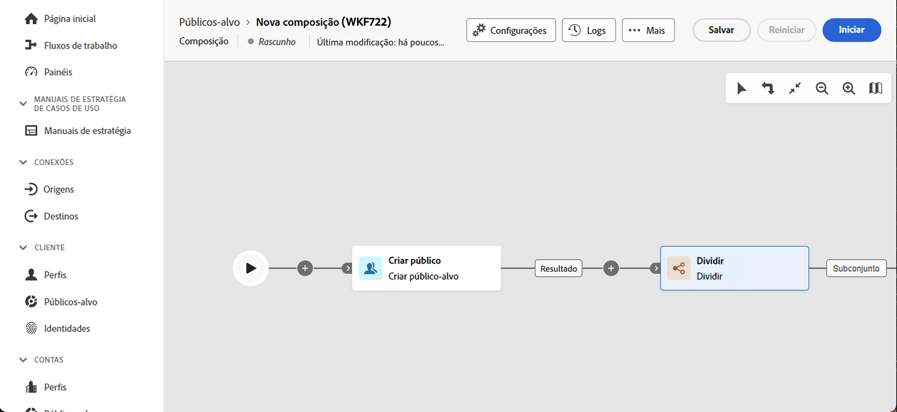

# Princípios básicos da criação de composição {#gs-composition-creation}

>[!CONTEXTUALHELP]
>id="dc_composition_creation_properties"
>title="Propriedades da composição"
>abstract="Nesta tela, escolha o modelo a ser usado para criar a composição e especifique um rótulo. Expanda a seção OPÇÕES ADICIONAIS para definir mais configurações, como o nome interno da composição, sua pasta, fuso horário e grupo supervisor. É altamente recomendável selecionar um grupo supervisor, para que, se ocorrer um erro, os operadores sejam alertados."

## O que há dentro de uma composição {#gs-composition-inside}

A Composição de público-alvo federado do Experience Platform fornece uma tela visual que permite criar públicos-alvo aproveitando várias atividades (dividir, enriquecer etc.).

O diagrama da composição é uma representação do que deveria acontecer. Ele descreve as várias tarefas a serem executadas e como elas estão vinculadas.

{zoomable="yes"} {zoomable="yes"}

Cada composição contém:

* **[!UICONTROL Atividades]**: uma atividade é uma tarefa a ser executada. As várias atividades são representadas no diagrama por ícones. Cada atividade tem propriedades específicas e outras propriedades que são comuns a todas as atividades.
* **[!UICONTROL Transições]**: as transições vinculam uma atividade de origem a uma atividade de destino e definem sua sequência.
* **[!UICONTROL Tabelas de trabalho]**: as tabelas de trabalho contêm todas as informações transportadas pela transição. Cada composição usa várias tabelas de trabalho. Os dados transmitidos nessas tabelas podem ser usados durante todo o ciclo de vida da composição.

## Etapas principais para criar uma composição {#gs-composition-steps}

As principais etapas para criar uma composição são as seguintes:

1. [Criar e configurar a composição](../compositions/create-composition.md)
1. [Orquestrar atividades](../compositions/orchestrate-activities.md)
1. [Executar a composição e monitorar sua execução](../compositions/start-monitor-composition.md)
