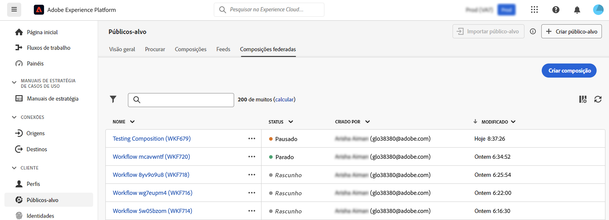
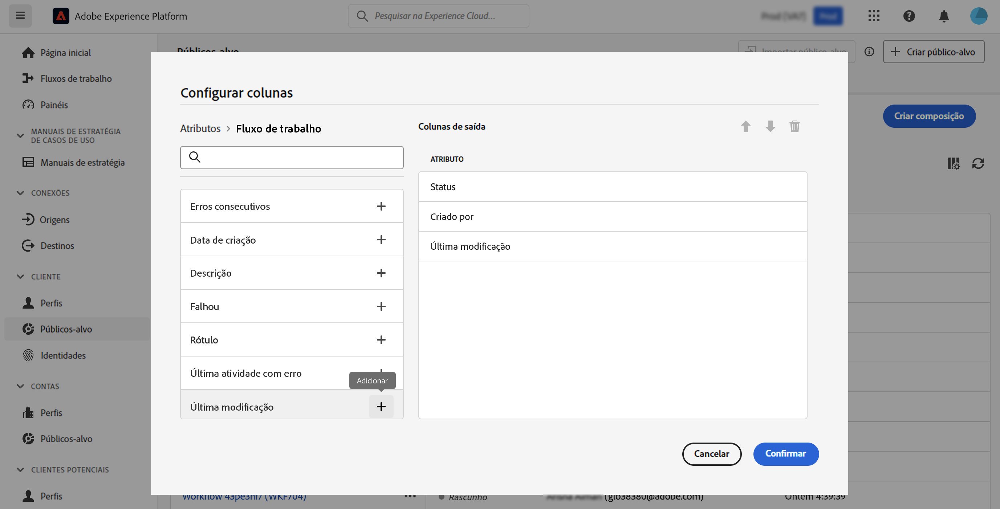

# Introdução a composições {#compositions}

## O que é uma composição {#what}

A Composição de público-alvo da Adobe permite criar composições onde você pode aproveitar várias atividades (divisão, exclusão...) em uma tela visual para criar públicos-alvo. Após a conclusão, os públicos-alvo resultantes são salvos na Adobe Experience Platform junto aos existentes e podem ser aproveitados nos destinos da Adobe Experience Platform e no Adobe Journey Optimizer para direcionamento de clientes. [Saiba como trabalhar com públicos-alvo](../start/audiences.md)

## Acessar e gerenciar composições {#access}

>[!CONTEXTUALHELP]
>id="dc_composition_list"
>title="Composições"
>abstract="Nesta tela, é possível acessar a lista completa de composições, verificar o status atual, as datas da última/próxima execução e criar uma nova composição."

As composições podem ser acessadas no menu **[!UICONTROL Públicos-alvo]** da Adobe Experience Platform, na guia **[!UICONTROL Composições federadas]**.

Nessa tela, é possível criar novas composições e acessar as já existentes. Também é possível duplicar ou excluir uma composição clicando no botão de reticências ao lado do nome.

Para refinar a lista e encontrar facilmente a composição que está procurando, você pode pesquisar na lista e filtrar as composições por status ou data do último processamento.

Você também pode personalizar a lista adicionando ou removendo colunas. Para fazer isso, clique no botão **[!UICONTROL Configurar coluna]**s e adicione ou remova as colunas de saída desejadas.

## Status das composições {#status}

As composições podem ter vários status:

* **[!UICONTROL Rascunho]**: a composição foi criada e salva.
* **[!UICONTROL Em andamento]**: a composição foi executada e está em execução no momento.
* **[!UICONTROL Parado]**: a execução da composição foi concluída e interrompida.
* **[!UICONTROL Pausado]**: a execução da composição foi pausada.
* **[!UICONTROL Errôneo]**: a execução da composição encontrou um erro. Abra a composição e acesse os logs e as tarefas para identificar o erro e resolvê-lo.

Informações detalhadas sobre como iniciar e monitorar uma composição estão disponíveis [nesta seção](../compositions/start-monitor-composition.md).
