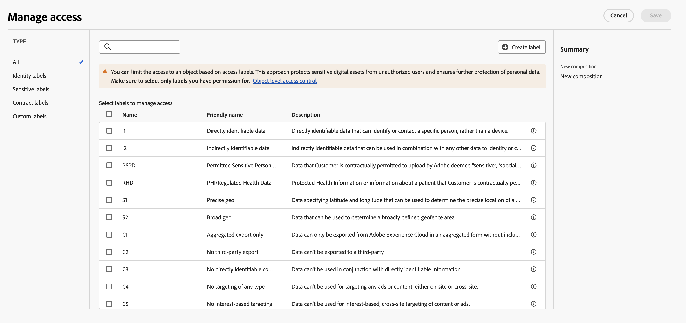

# Introdução a composições {#compositions}

>[!AVAILABILITY]
>
>Para acessar composições, você precisará de uma das seguintes permissões:
>
>-**Gerenciar composições federadas**
>>-**Visualizar composições federadas**
>
>Para obter mais informações sobre as permissões necessárias, leia o [guia de controle de acesso](/help/governance-privacy-security/access-control.md).

A Composição de público-alvo federado permite criar composições, onde você pode aproveitar várias atividades em uma tela visual para criar públicos-alvo. Depois de criar sua composição, os públicos-alvo resultantes são salvos no Adobe Experience Platform e podem ser aproveitados nos destinos do Experience Platform e no Adobe Journey Optimizer para clientes-alvo.

{zoomable="yes"}{width="70%"}

## Acessar e gerenciar composições {#access}

>[!CONTEXTUALHELP]
>id="dc_composition_list"
>title="Composições"
>abstract="Nesta tela, é possível acessar a lista completa de composições, verificar o status atual, as datas da última/próxima execução e criar uma nova composição."

As composições podem ser acessadas no menu **[!UICONTROL Públicos-alvo]** do Adobe Experience Platform, na guia **[!UICONTROL Composições federadas]**, na seção **[!UICONTROL Clientes]**.

Nessa tela, é possível criar novas composições e acessar as já existentes. Também é possível duplicar ou excluir uma composição existente selecionando o botão  ao lado do nome.

Você também pode exibir informações sobre as composições, incluindo o nome, o status, o criador e a última data de modificação.

| Status | Descrição |
| ------ | ----------- |
| **[!UICONTROL Rascunho]** | A composição foi criada e salva. |
| **[!UICONTROL Em andamento]** | A composição foi executada e está em execução no momento. |
| **[!UICONTROL Parado]** | A execução da composição foi concluída e interrompida. |
| **[!UICONTROL Em pausa]** | A execução da composição foi pausada. |
| **[!UICONTROL Incorreto]** | A execução da composição encontrou um erro. Para exibir mais informações sobre o erro, abra a composição e acesse os logs. |

Você pode aprender a iniciar ou parar uma composição no [guia de início e monitoramento de composição](./start-monitor-composition.md).

{zoomable="yes"}{width="70%"}{align="center"}

Para refinar a lista e encontrar a composição que está procurando, você pode pesquisar a lista e filtrar composições por status ou datas do último processamento.

Você também pode personalizar a lista adicionando ou removendo colunas. Para fazer isso, selecione o botão **[!UICONTROL Configurar colunas]** e adicione ou remova as colunas de saída desejadas.

{zoomable="yes"}{width="70%"}{align="center"}

### Aplicar rótulos de acesso {#access-labels}

Para aplicar rótulos de acesso a uma composição específica, selecione a composição, seguida por **[!UICONTROL Gerenciar acesso]**.

{zoomable="yes"}{width="70%"}{align="center"}

O popover **[!UICONTROL Gerenciar acesso]** é exibido. Nessa página, você pode aplicar os rótulos de acesso e governança de dados aplicáveis à sua composição.

{zoomable="yes"}{width="70%"}{align="center"}

| Tipo de rótulo | Descrição |
| ---------- | ----------- |
| Rótulos de contrato | Os rótulos de contrato (rótulos &quot;C&quot;) são usados para categorizar dados que contêm obrigações contratuais ou estão relacionados às políticas de governança de dados da sua organização. |
| Rótulos de identidade | Rótulos de identidade (rótulos &quot;I&quot;) são usados para categorizar dados que podem identificar ou entrar em contato com uma pessoa específica. |
| Rótulos sigilosos | Rótulos de sensibilidade (rótulos &quot;S&quot;) são usados para categorizar você e/ou sua organização a considerar sensíveis. |
| Rótulos de ecossistema de parceiros | Os rótulos do ecossistema do parceiro são usados para categorizar dados de fontes externas à organização. |

Para obter mais informações sobre rótulos de acesso e governança de dados, leia o [glossário de rótulos de uso de dados](https://experienceleague.adobe.com/en/docs/experience-platform/data-governance/labels/reference).

## Próximas etapas

Depois de ler este guia, você aprendeu a acessar, gerenciar e criar rótulos de acesso para suas composições. Para obter mais informações sobre como trabalhar com públicos-alvo como um todo, leia o [guia de públicos-alvo](../start/audiences.md).
