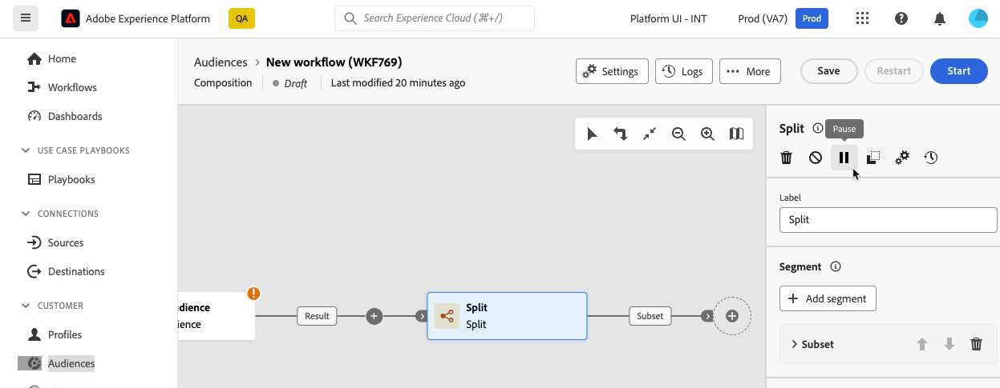

# Orquestrar atividades de composição {#activities}

Depois de criar uma composição, você pode começar a orquestrar as diferentes tarefas que ela executará. Para fazer isso, é fornecida uma tela visual, que permite construir o diagrama de composição. Neste diagrama, é possível adicionar várias atividades e conectá-las em ordem sequencial.

## Adicionar atividades {#add}

Nessa etapa da configuração, o diagrama é exibido com um ícone de início, representando o início do workflow. Para adicionar sua primeira atividade, clique no link **+** botão conectado ao ícone iniciar.

Uma lista de atividades que podem ser adicionadas ao diagrama é exibida. As atividades disponíveis dependem da sua posição no diagrama de composição. Por exemplo, ao adicionar sua primeira atividade, é possível iniciar sua composição direcionando um público-alvo, dividindo o caminho do fluxo de trabalho, configurando um scheduler para atrasar a execução do fluxo de trabalho ou definindo um **Aguardar** atividade para atrasar a execução do workflow. Por outro lado, depois de uma **Criar público-alvo** atividade, você pode refinar seu público-alvo com atividades de direcionamento ou organizar o processo de composição com atividades de controle de fluxo.

Depois que uma atividade é adicionada ao diagrama, um painel direito é exibido, permitindo configurar a atividade recém-adicionada com configurações específicas. Informações detalhadas sobre como configurar cada atividade estão disponíveis em [nesta seção](activities/about-activities.md).

Repita esse processo para adicionar quantas atividades desejar, dependendo das tarefas que deseja que sua composição execute. Observe que você também pode inserir uma nova atividade entre duas atividades. Para fazer isso, clique no link **+** na transição entre as atividades, selecione a atividade desejada e a configure no painel direito.

>[!TIP]
>
>Você tem a opção de personalizar o nome das transições entre cada atividade. Para fazer isso, selecione a transição e altere seu rótulo no painel direito.

## A barra de ferramentas da tela {#toolbar}

A barra de ferramentas localizada no canto superior direito da tela fornece opções para manipular facilmente as atividades e navegar na tela.

As ações disponíveis são:

* **Seleção múltipla**: selecione várias atividades para excluir todas de uma vez ou copie e cole as atividades. Consulte [esta seção](#copy).
* **Girar**: Alterne a tela de desenho verticalmente.
* **Ajustar à tela**: adapte o nível de zoom da tela de desenho à sua tela.
* **Menos zoom** / **Mais zoom**: Reduza ou na tela de desenho.
* **Exibir mapa**: abre um instantâneo da tela mostrando que você está localizado.

## Gerenciar atividades {#manage}

Ao adicionar atividades, os botões de ação ficam disponíveis no painel de propriedades, permitindo que você execute várias operações.

É possível:

* **Excluir** a atividade da tela.
* **Desativar/Ativar** a atividade. Quando o workflow é executado, as atividades desativadas e as atividades a seguir no mesmo caminho não são executadas e o workflow é interrompido.
* **Pausar/Retomar** a atividade. Quando o workflow é executado, ele é pausado na atividade pausada. A tarefa correspondente, bem como todas as que a seguem no mesmo caminho, não são executadas.
* **Copiar** a atividade para colá-la em outro local da composição. Para fazer isso, clique no link **+** em uma transição e selecione &quot;Colar atividade X&quot;. <!-- cannot copy multiple activities ? cannot paste in another composition?-->
* Configurar **Opções de execução** para a atividade selecionada. Expanda a seção abaixo para saber mais sobre as opções disponíveis.

  +++Opções de execução disponíveis

  A variável **Propriedades** permite definir configurações genéricas relacionadas à execução da atividade:

   * **Execução**: defina a ação que será executada quando o for iniciado.
   * **Duração máxima da execução**: especifique uma duração como &quot;30s&quot; ou &quot;1h&quot;. Se a atividade não for concluída após o término da duração especificada, um alerta será acionado. Isso não afeta o funcionamento do fluxo de trabalho.
   * **Fuso horário**: selecione o fuso horário da atividade. A Composição de público-alvo federado permite gerenciar as diferenças de tempo entre vários países na mesma instância. A configuração aplicada é definida quando a instância é criada.
   * **Afinidade**: force a atividade de composição a ser executada em uma máquina específica. Para fazer isso, é necessário especificar uma ou várias afinidades para a atividade em questão.
   * **Comportamento**: defina o procedimento a ser seguido se tarefas assíncronas forem usadas.

  A variável **Gerenciamento de erros** permite especificar a ação a ser executada caso a atividade encontre um erro.

  A variável **Script de inicialização** permite inicializar variáveis ou modificar propriedades da atividade. Clique em **Editar código** e digite o trecho de código a ser executado. O script é chamado quando a atividade é executada.

+++

* Acessar o da atividade **Logs e tarefas**.
