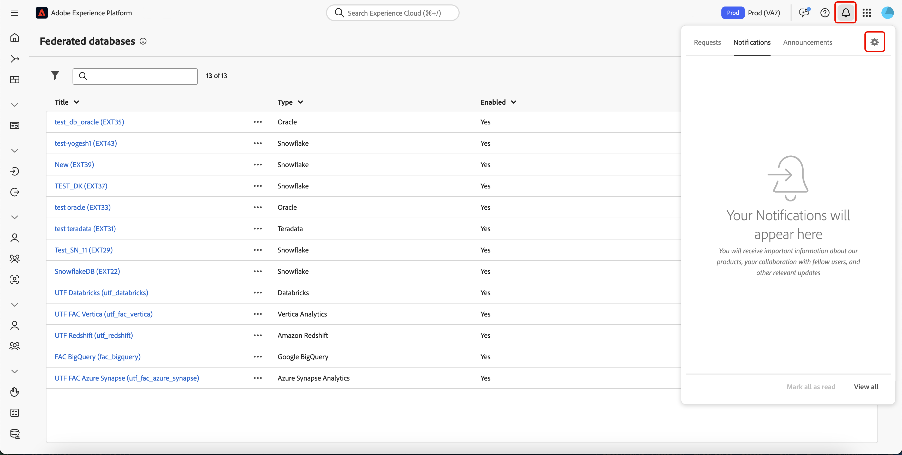

# Iniciar e monitorar sua composição {#start-monitor}

Depois de criar sua composição e projetar as tarefas a serem executadas na tela, você poderá iniciá-la e monitorar como ela está sendo executada.

## Iniciar a composição {#start}

Para iniciar uma composição, clique no botão **[!UICONTROL Iniciar]** no canto superior direito da tela. Quando a composição está em execução, cada atividade na tela é executada em ordem sequencial, até que o final da composição seja atingido.

Você pode acompanhar o progresso de perfis direcionados em tempo real usando um fluxo visual. Isso permite identificar rapidamente o status de cada atividade e o número de perfis em transição entre elas.

## Transições de composição {#transitions}

Em composições, os dados transportados de uma atividade para outra por meio de transições são armazenados em uma tabela de trabalho temporária. Esses dados podem ser exibidos para cada transição. Para fazer isso, selecione uma transição para abrir as propriedades no lado direito da tela.

* Clique em **[!UICONTROL Visualizar esquema]** para exibir o esquema da tabela de trabalho.
* Clique em **[!UICONTROL Visualizar resultados]** para visualizar os dados transportados na transição selecionada. Esta opção estará disponível somente se a opção **[!UICONTROL Keep the result of interim populations between two executions]** estiver habilitada. [Saiba mais](create-composition.md#settings).

## Monitorar execução da atividade {#activities}

Os indicadores visuais no canto superior direito de cada caixa de atividade permitem verificar a execução:

| Indicador visual | Descrição |
|-----|------------|
| {zoomable="yes"}{width="70%"} | A atividade está sendo executada no momento. |
| {zoomable="yes"}{width="70%"} | A atividade requer a sua atenção. Isso pode envolver confirmar o envio de uma entrega ou realizar uma ação necessária. |
| {zoomable="yes"}{width="70%"} | A atividade encontrou um erro. Para resolver o problema, abra os logs de composição para obter mais informações. |
| {zoomable="yes"}{width="70%"} | A atividade foi executada com sucesso. |

## Monitorar logs e tarefas {#logs-tasks}

O monitoramento de logs e tarefas de composição é uma etapa essencial para analisar suas composições e garantir que elas estejam sendo executadas corretamente. Eles podem ser acessados pelo botão **[!UICONTROL Logs]**, que está disponível na barra de ferramentas de ações e no painel de propriedades de cada atividade.

A tela **[!UICONTROL Tarefas e logs de composição]** fornece um histórico da execução da composição, registrando todas as ações do usuário e encontrando erros.

<!-- à confirmer, pas trouvé dans les options = The workflow history is saved for the duration specified in the workflow execution options. During this duration, all the messages are therefore saved, even after a restart. If you do not want to save the messages from a previous execution, you have to purge the history by clicking the  button.-->

O histórico é organizado em várias guias, detalhadas abaixo:

* A guia **[!UICONTROL Log]** contém o histórico de execução de todas as atividades de composição. Ele indexa as operações realizadas e os erros de execução por ordem cronológica.
* A guia **[!UICONTROL Tasks]** detalha a sequência de execução das atividades. O botão localizado no final de cada tarefa permite listar as variáveis de evento transmitidas pela atividade.
* A guia **[!UICONTROL Variáveis]** lista todas as variáveis passadas na composição. Ela está disponível ao acessar os logs e as tarefas somente a partir da tela de composição. Agora está disponível ao acessar os logs por meio do painel de propriedades de uma atividade.  <!-- à confirmer-->

Em todas as guias, você pode escolher as colunas exibidas e sua ordem, aplicar filtros e usar o campo de pesquisa para localizar rapidamente as informações desejadas.

## Assinatura de alertas {#alerts}

Além disso, você pode assinar alertas para receber notificações se as execuções de composição federada tiverem sido bem-sucedidas ou falharem.

Para assinar alertas, selecione o , seguido do .

{zoomable="yes"}{width="70%"}

A página de configurações de notificações é exibida. Nesta página, selecione **[!UICONTROL Experience Platform]** e escolha os canais de alertas desejados. Para ver as notificações na interface, selecione **[!UICONTROL No aplicativo]**.

{zoomable="yes"}{width="50%"}

Com **[!UICONTROL No aplicativo]** selecionado, você será notificado agora sobre êxitos e falhas na execução de composição.

{zoomable="yes"}{width="70%"}

## Comandos de execução de composição {#execution-commands}

A barra de ação no canto superior direito fornece comandos que permitem gerenciar a execução da composição.

As ações disponíveis são:

* **[!UICONTROL Início]**: inicia a execução da composição, que assume o status **[!UICONTROL Em andamento]**. A composição é iniciada e as atividades iniciais são ativadas.

* **[!UICONTROL Retomar]**: retoma a execução da composição que foi pausada. A composição recebe o status **[!UICONTROL Em andamento]**.

* **[!UICONTROL Pausar]** a execução da composição, que assume o status **[!UICONTROL Pausado]**. Nenhuma nova atividade será ativada até que seja retomada, mas as operações em andamento não são suspensas.

* **[!UICONTROL Parar]** uma composição que está sendo executada, que assumirá o status **[!UICONTROL Concluído]**. Se possível, as operações em andamento são interrompidas. Não é possível retomar da composição no mesmo local em que ela foi interrompida.

* **[!UICONTROL Reiniciar]**: para e reinicia uma composição. Na maioria dos casos, isso permite que você reinicie mais rápido, pois a interrupção leva um certo tempo, e o botão **[!UICONTROL Iniciar]** só estará disponível quando a interrupção for efetiva.

