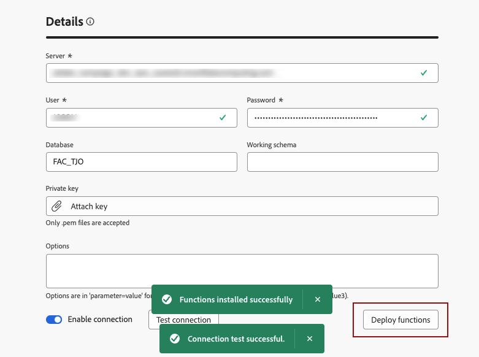

# Criar conexões {#connections-fdb}

A Composição de público-alvo federado da Experience Platform permite que o Cliente crie e enriqueça públicos-alvo de data warehouses de terceiros e importe os públicos-alvo para a Adobe Experience Platform. Os datawarehouses com suporte estão listados em [esta seção](../start/access-prerequisites.md#supported-systems).

Para trabalhar com o banco de dados federado e o Adobe Experience Platform, primeiro é necessário estabelecer uma conexão. Essa conexão é configurada em uma interface de usuário dedicada disponível na interface do usuário do Adobe Experience Platform, conforme detalhado nesta página.

Para configurar uma conexão com seu banco de dados, siga estas etapas:

1. Navegue até a seção **[!UICONTROL DADOS FEDERADOS]** no painel esquerdo.

1. No link **[!UICONTROL Federated databases]**, clique no botão **[!UICONTROL Adicionar banco de dados federado]**.

   {zoomable="yes"}

1. Defina a conexão **[!UICONTROL Propriedades]**, com o nome e o tipo do banco de dados.

   {zoomable="yes"}

   Selecionar o tipo dá acesso a outras propriedades para preencher. Saiba mais aqui sobre os bancos de dados com suporte em [esta página](federated-db.md).

   {zoomable="yes"}

   As configurações dependem do tipo do banco de dados. Navegue pelos links abaixo para acessar os detalhes necessários para configurar a conexão:

   * [Amazon Redshift](federated-db.md#amazon-redshift)
   * [Azure Synapse](federated-db.md#azure-synapse-redshift)
   * [Databricks](federated-db.md#databricks)
   * [Google Big Query](federated-db.md#google-big-query)
   * [Snowflake](federated-db.md#snowflake)
   * [Vertica Analytics](federated-db.md#vertica-analytics)
   * [Microsoft Fabric](federated-db.md#microsoft-fabric)

1. Para cada banco de dados suportado, selecione o botão **[!UICONTROL IP do Servidor]**. A lista de todos os IPs associados às instâncias de Composição de público federado é exibida.

   {zoomable="yes"}

   Clique em um IP na lista para copiá-lo no sistema e autorizar a conexão desse IP ao banco de dados.

   >[!NOTE]
   >
   >Para usar a Federated Audience Composition para um determinado banco de dados, você deve lista de permissões todos os endereços IP associados a esse banco de dados.

1. Depois de preencher os detalhes, clique no botão **[!UICONTROL Testar conexão]** e no botão **[!UICONTROL Implantar funções]**.

   {zoomable="yes"}

1. Conclua a criação da sua conexão clicando no botão **[!UICONTROL Salvar]**.

   Uma visão geral da sua conexão com o Federated database está disponível, conforme mostrado abaixo:

   {zoomable="yes"}
