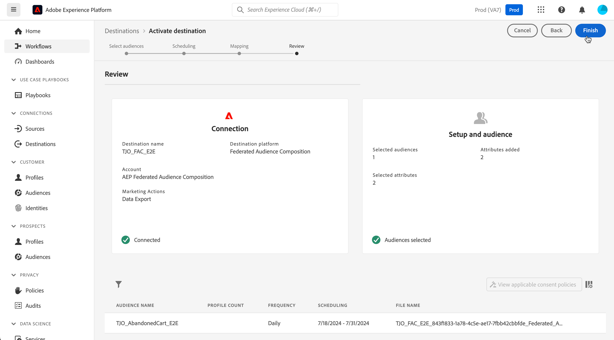

# Enriqueça os públicos-alvo da Adobe Experience Platform com dados externos {#connect-aep-fac}

>[!CONTEXTUALHELP]
>id="dc_new_destination"
>title="Criar um destino"
>abstract="Defina as configurações para se conectar ao novo banco de dados federado. Use o botão **[!UICONTROL Conectar ao destino]** para validar a configuração."

O Adobe Experience Platform permite a integração perfeita de públicos do Portal de público-alvo com seus bancos de dados externos usando o **destino do Adobe Federated Audience Composition**. Com essa integração, você pode aproveitar os públicos existentes em composições e enriquecê-los ou refiná-los usando dados de seus bancos de dados externos para criar novos públicos.

Para fazer isso, é necessário configurar uma nova conexão no Adobe Experience Platform para o destino do Adobe Federated Audience Composition. Você pode usar um scheduler para enviar um determinado público-alvo em frequências regulares, selecionar atributos específicos a serem incluídos, como IDs para reconciliação de dados. Se você tiver aplicado políticas de governança e privacidade ao público-alvo, elas serão mantidas e enviadas de volta ao portal de público-alvo depois que o público-alvo for atualizado.

Por exemplo, digamos que você esteja armazenando informações de compra em seu data warehouse e tenha um público do Adobe Experience Platform direcionado a clientes interessados em um produto específico nos últimos dois meses. Ao usar o destino da Composição de público-alvo federado, você pode:

* Refine o público com base nas informações de compra. Por exemplo, você pode filtrar o público-alvo para clientes do público-alvo que fizeram uma compra de apenas mais de US$ 150.
* Enriqueça o público-alvo com campos relacionados às compras, como o nome do produto e a quantidade comprada.

## Ativar público para destino {#activate}

No catálogo de Destinos do Adobe Experience Platform, selecione o destino da Composição de público federado. No painel direito, selecione **[!UICONTROL Configurar novo destino]**.

A página **[!UICONTROL Configurar novo destino]** é exibida. Nesta página, você pode configurar detalhes do seu destino, incluindo o nome, a descrição, o tipo de conexão e o banco de dados federado.

Na seção **[!UICONTROL Alertas]**, você pode habilitar alertas para receber notificações sobre o status do fluxo de dados para o seu destino. Isso inclui alertas de atrasos de execução de fluxo de dados, falhas de execução, sucessos de execução, inicializações de execução e ignoramentos de ativação.

Para obter mais informações sobre alertas, leia a documentação do Adobe Experience Platform sobre [assinatura em alertas de destinos usando a interface](https://experienceleague.adobe.com/en/docs/experience-platform/destinations/ui/alerts){target="_blank"}.

Após concluir a configuração dos detalhes do seu destino, selecione **[!UICONTROL Avançar]**. A etapa **[!UICONTROL Política de governança e ações de aplicação]** é exibida. Nesta página, você pode definir suas políticas de governança de dados e garantir que os dados usados estejam em conformidade quando os públicos-alvo forem enviados e estiverem ativos.

Quando terminar de selecionar as ações de marketing desejadas para o destino, selecione **[!UICONTROL Criar]**.

A nova conexão com o destino é criada. Agora você pode ativar os públicos-alvo para enviá-los ao destino. Escolha o destino para o qual deseja ativar os públicos-alvo, seguido por **[!UICONTROL Próximo]**.

A etapa **[!UICONTROL Agendando]** é exibida. Você pode selecionar os públicos-alvo desejados que deseja ativar para o destino. Para configurar um agendamento, selecione  para editar seu agendamento de exportação.

O popover **[!UICONTROL Agendando]** é exibido. Nesse popover, você pode definir as opções de exportação de arquivo, a frequência e configurar o cronograma.

>[!NOTE]
>
>Para ativar os públicos-alvo mais rapidamente, selecione a opção **[!UICONTROL Após a avaliação do segmento]** para acionar o trabalho de ativação imediatamente após a conclusão diária do trabalho de segmentação em lote do Platform.
>
>Para obter informações detalhadas sobre como configurar um agendamento e nomes de arquivo, leia as seguintes seções da documentação do Adobe Experience Platform:
>
>* [Agendar exportação de público-alvo](https://experienceleague.adobe.com/en/docs/experience-platform/destinations/ui/activate/activate-batch-profile-destinations#scheduling){target="_blank"}
>* [Configurar nomes de arquivo](https://experienceleague.adobe.com/en/docs/experience-platform/destinations/ui/activate/activate-batch-profile-destinations#configure-file-names){target="_blank"}

Na etapa **[!UICONTROL Mapping]**, selecione quais campos de atributo e identidade serão exportados para seu(s) público(s).

>[!IMPORTANT]
>
>Você **não pode** usar colunas geradas pelo sistema ao ativar para destinos. Selecionar uma coluna gerada pelo sistema causará um erro.

Para obter mais informações, leia a [seção de mapeamento](https://experienceleague.adobe.com/en/docs/experience-platform/destinations/ui/activate/activate-batch-profile-destinations#mapping){target="_blank"} na documentação do Adobe Experience Platform.

Revise a configuração de destino e as configurações de público e selecione **[!UICONTROL Concluir]**.

Os públicos-alvo selecionados agora estão ativados para a nova conexão. Você pode adicionar mais públicos-alvo para enviar com esta conexão navegando de volta para a página **[!UICONTROL Ativar públicos-alvo]**. Não é possível remover públicos-alvo depois de ativados.
