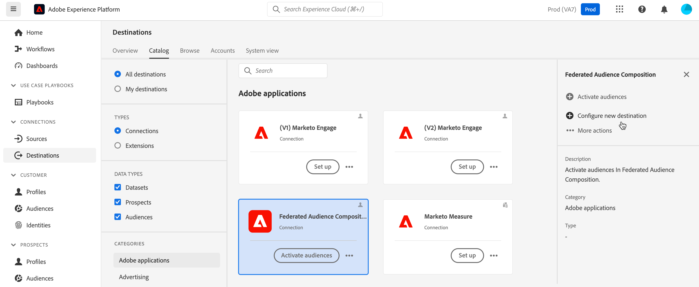

# Enviar Adobe Experience Platform para a composição de público-alvo federado do Adobe {#connect-aep-fac}

>[!CONTEXTUALHELP]
>id="dc_new_destination"
>title="Criar um destino"
>abstract="Defina as configurações para se conectar ao novo banco de dados federado. Use o botão **[!UICONTROL Conectar ao destino]** para validar a configuração."

O Adobe Experience Platform permite enviar públicos-alvo do portal de público-alvo para a Adobe Composição de público-alvo federado. Ao fazer isso, você pode aproveitar os públicos existentes em composições e combiná-los com dados de seus bancos de dados externos para criar novos públicos ou atualizar os existentes.

Para fazer isso, é necessário configurar uma nova conexão no Adobe Experience Platform para o destino Adobe Federated Audience Composition. Você pode usar um scheduler para enviar um determinado público-alvo em frequências regulares e escolher quais campos enviar com o público-alvo, como IDs, para reconciliar os dados. Se você tiver aplicado políticas de governança e privacidade ao público-alvo, elas serão mantidas e enviadas de volta ao portal de público-alvo depois que o público-alvo for atualizado.

As principais etapas para enviar públicos-alvo da Adobe Experience Platform para a Composição de público-alvo federado do Adobe são as seguintes:

1. Acesse o catálogo Destinos do Adobe Experience Platform e selecione o destino da Composição do Audience Federado.

   No painel direito, selecione **[!UICONTROL Configurar novo destino]**.

   

1. Forneça um nome para a nova conexão, escolha o **[!UICONTROL Tipo de conexão]** a ser usado e o **[!UICONTROL Banco de dados federado]** ao qual você deseja se conectar e clique em **[!UICONTROL Avançar]**.

   

   A seção **[!UICONTROL Alertas]** permite habilitar alertas para receber notificações sobre o status do fluxo de dados para o seu destino. Para obter mais informações sobre alertas, consulte o manual sobre [assinatura de alertas de destinos usando a interface](https://experienceleague.adobe.com/en/docs/experience-platform/destinations/ui/alerts).

1. Na etapa **[!UICONTROL Política de governança e ações de aplicação]**, você pode definir suas políticas de governança de dados e garantir que os dados usados estejam em conformidade quando os públicos-alvo forem enviados e estiverem ativos.

   Quando você terminar de selecionar as ações de marketing desejadas para o destino, clique em **[!UICONTROL Criar]**.

1. A nova conexão com o destino é criada. Agora você pode ativar os públicos-alvo para enviá-los ao destino. Para fazer isso, selecione-o na lista e clique em **[!UICONTROL Avançar]**

   

1. Selecione os públicos desejados que você deseja enviar e clique em **[!UICONTROL Avançar]**.

1. Configure o nome do arquivo e um agendamento de exportação para o(s) público(s) selecionado(s).

   

   >[!NOTE]
   >
   >Informações detalhadas sobre como configurar um agendamento e nomes de arquivo estão disponíveis na documentação do Adobe Experience Platform:
   >* [Agendar exportação de público-alvo](https://experienceleague.adobe.com/en/docs/experience-platform/destinations/ui/activate/activate-batch-profile-destinations#scheduling)
   >* [Configurar nomes de arquivo](https://experienceleague.adobe.com/en/docs/experience-platform/destinations/ui/activate/activate-batch-profile-destinations#configure-file-names)

1. Na etapa **[!UICONTROL Mapping]**, selecione quais campos de atributo e identidade serão exportados para seu(s) público(s). Para obter mais informações, exiba a [etapa de mapeamento](https://experienceleague.adobe.com/en/docs/experience-platform/destinations/ui/activate/activate-batch-profile-destinations#mapping) na documentação do Adobe Experience Platform.

   

1. Revise a configuração de destino e as configurações de público e clique em **[!UICONTROL Concluir]**.

   

Os públicos-alvo selecionados agora estão ativados para a nova conexão. Você pode adicionar mais públicos-alvo para enviar com esta conexão navegando de volta para a página **[!UICONTROL Ativar públicos-alvo]**. Não é possível remover públicos-alvo depois de ativados.
