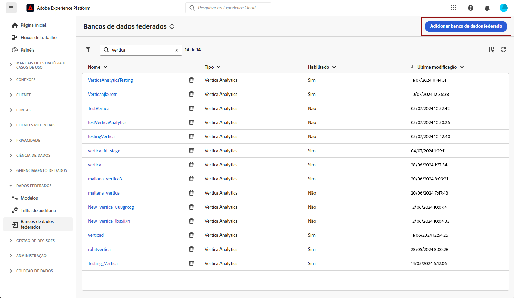
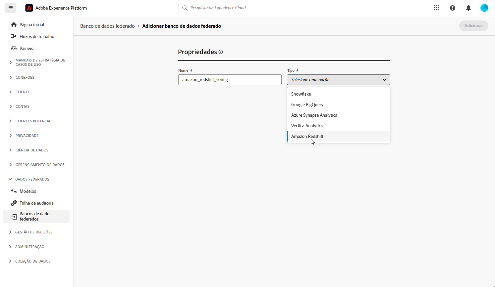
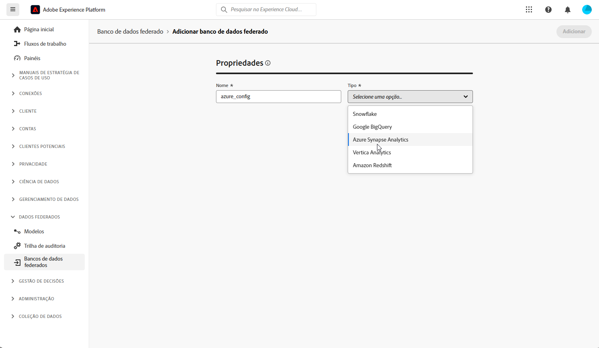
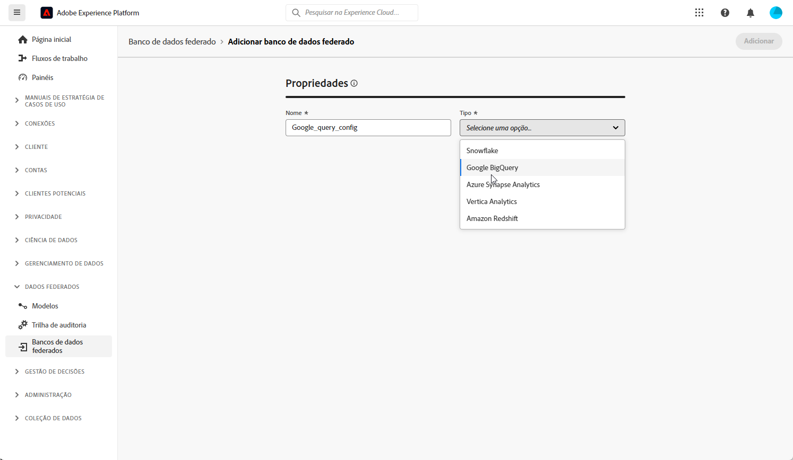
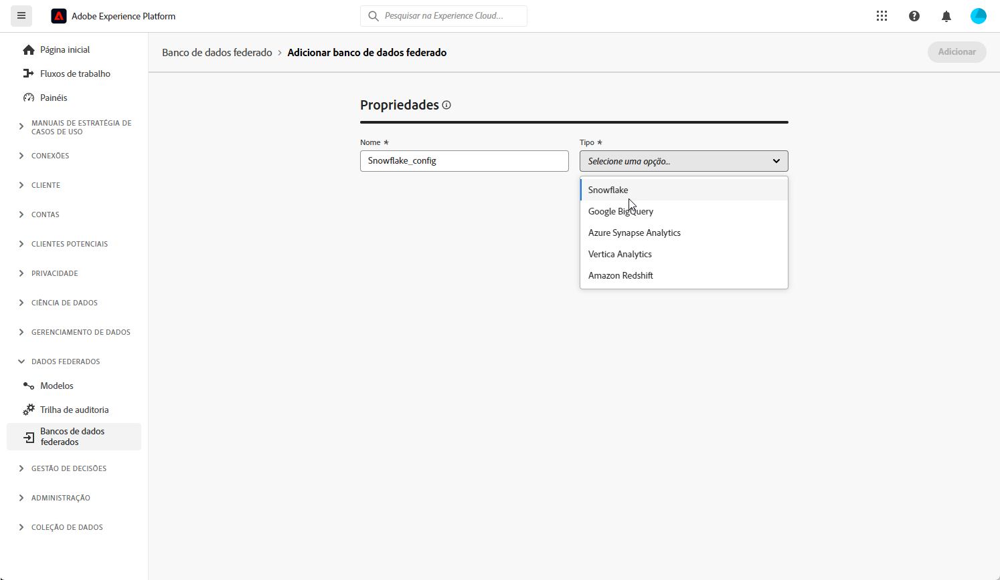
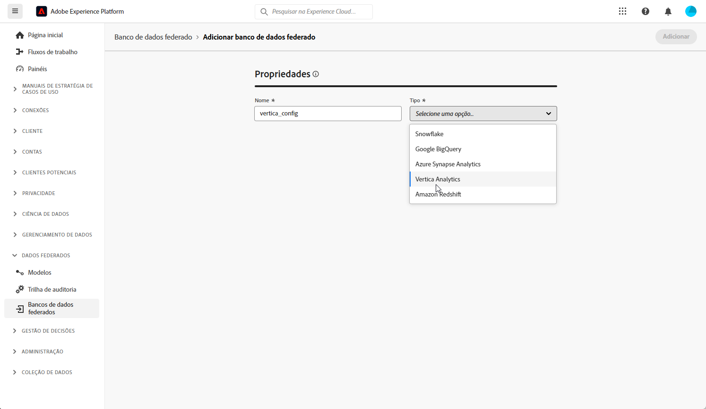
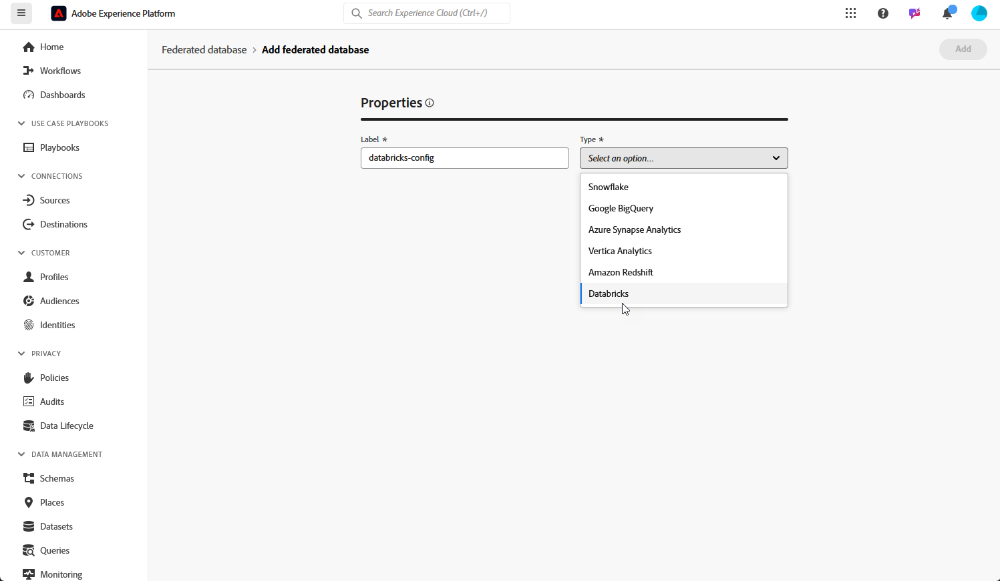

# Configurar bancos de dados federados {#federated-db}

>[!CONTEXTUALHELP]
>id="dc_connection_federated_database_menu"
>title="Bancos de dados federados"
>abstract="As conexões existentes com bancos de dados federados estão listadas nesta tela. Para criar uma nova conexão, clique no botão **[!UICONTROL Adicionar banco de dados federados]**."

>[!CONTEXTUALHELP]
>id="dc_connection_federated_database_properties"
>title="Propriedades do banco de dados federado"
>abstract="Insira o nome do novo banco de dados federado e selecione seu tipo."

>[!CONTEXTUALHELP]
>id="dc_connection_federated_database_details"
>title="Detalhes do Banco de dados federado"
>abstract="Defina as configurações para se conectar ao novo banco de dados federado. Use o botão **[!UICONTROL Testar conexão]** para validar a configuração."

A Composição de público-alvo federado da Experience Platform permite que o cliente crie e enriqueça públicos-alvo vindos de data warehouses de terceiros e os importe para a Adobe Experience Platform.

Saiba como criar, configurar, testar e salvar a conexão com seu banco de dados externo [nesta página](connections.md). Você pode encontrar abaixo a lista de bancos de dados compatíveis e as configurações detalhadas a serem definidas para cada um deles.

## Bancos de dados compatíveis {#supported-db}

Com a Composição de público-alvo federado, você pode se conectar aos seguintes bancos de dados. A configuração de cada banco de dados é detalhada abaixo.

* [Amazon Redshift](#amazon-redshift)
* [Azure Synapse Analytics](#azure-synapse)
* [Google Big Query](#google-big-query)
* [Snowflake](#snowflake)
* [Vertica Analytics](#vertica-analytics)
* [Databricks](#databricks)
* [Microsoft Fabric](#microsoft-fabric)

## Amazon Redshift {#amazon-redshift}

>[!AVAILABILITY]
>
>Somente o Amazon Redshift AWS, o Amazon Redshift Spectrum e o Amazon Redshift Serverless são compatíveis.

Use bancos de dados federados para processar informações armazenadas em um banco de dados externo. Siga as etapas abaixo para configurar o acesso ao Amazon Redshift.

1. No menu **[!UICONTROL Dados federados]**, selecione **[!UICONTROL Bancos de dados federados]**.

1. Clique em **[!UICONTROL Adicionar banco de dados federado]**.

   

1. Insira um **[!UICONTROL Nome]** para o banco de dados federado.

1. No menu suspenso **[!UICONTROL Tipo]**, selecione Amazon Redshift.

   

1. Defina as configurações de autenticação do Amazon Redshift:

   * **[!UICONTROL Servidor]**: adicione o nome do DNS.

   * **[!UICONTROL Conta]**: adicione o nome de usuário.

   * **[!UICONTROL Senha]**: adicione a senha da conta.

   * **[!UICONTROL Banco de dados]**: nome do banco de dados, se não estiver especificado no DSN. Pode ficar em branco, se estiver especificado no DSN

   * **[!UICONTROL Esquema de trabalho]**: nome do esquema de banco de dados a ser usado para tabelas de trabalho. Saiba mais na [Documentação da Amazon](https://docs.aws.amazon.com/redshift/latest/dg/r_Schemas_and_tables.html){target="_blank"}

     >[!NOTE]
     >
     >Você pode usar qualquer esquema do banco de dados, incluindo esquemas usados para processamento temporário de dados, desde que tenha a permissão necessária para se conectar a esse esquema.
     >
     >**Esquemas de trabalho distintos** devem ser usados ao conectar várias sandboxes ao mesmo banco de dados.

1. Selecione a opção **[!UICONTROL Testar a conexão]** para verificar sua configuração.

1. Clique no botão **[!UICONTROL Implantar funções]** para criar as funções.

1. Quando a configuração estiver concluída, clique em **[!UICONTROL Adicionar]** para criar o banco de dados federado.

## Azure Synapse Analytics {#azure-synapse}

Use bancos de dados federados para processar informações armazenadas em um banco de dados externo. Siga as etapas abaixo para configurar o acesso ao Azure Synapse Analytics.

1. No menu **[!UICONTROL Dados federados]**, selecione **[!UICONTROL Bancos de dados federados]**.

1. Clique em **[!UICONTROL Adicionar banco de dados federado]**.

   

1. Insira um **[!UICONTROL Nome]** para o banco de dados federado.

1. No menu suspenso **[!UICONTROL Tipo]**, selecione Azure Synapse Analytics.

   

1. Defina as configurações de autenticação do Azure Synapse Analytics:

   * **[!UICONTROL Servidor]**: insira o URL do servidor Azure Synapse.

   * **[!UICONTROL Conta]**: insira o nome de usuário.

   * **[!UICONTROL Senha]**: insira a senha da conta.

   * **[!UICONTROL Banco de Dados]** (opcional): insira o nome do banco de dados se não estiver especificado no DSN.

   * **[!UICONTROL Opções]**: o conector é compatível com as opções detalhadas na tabela abaixo.

1. Selecione a opção **[!UICONTROL Testar a conexão]** para verificar a configuração.

1. Clique no botão **[!UICONTROL Implantar funções]** para criar as funções.

1. Quando a configuração estiver concluída, clique em **[!UICONTROL Adicionar]** para criar o banco de dados Federado.

| Opção | Descrição |
|---|---|
| Autenticação | Tipo de autenticação compatível com o conector. Valor compatível atual: ActiveDirectoryMSI. Para obter mais informações, consulte a [documentação do Microsoft SQL](https://learn.microsoft.com/pt-br/sql/connect/odbc/using-azure-active-directory?view=sql-server-ver15#example-connection-strings){target="_blank"} (exemplo de strings de conexão n°8) |

## Google Big Query {#google-big-query}

Use bancos de dados federados para processar informações armazenadas em um banco de dados externo. Siga as etapas abaixo para configurar o acesso ao Google BigQuery.

1. No menu **[!UICONTROL Dados federados]**, selecione **[!UICONTROL Banco de dados federado]**.

1. Clique em **[!UICONTROL Adicionar banco de dados federado]**.

   

1. Insira um **[!UICONTROL Nome]** para o banco de dados federado.

1. No menu suspenso **[!UICONTROL Tipo]**, selecione Google BigQuery.

   

1. Defina as configurações de autenticação do Google BigQuery:

   * **[!UICONTROL Conta de serviço]**: insira o email da sua **[!UICONTROL Conta de serviço]**. Para obter mais informações, consulte a [documentação do Google Cloud](https://cloud.google.com/iam/docs/creating-managing-service-accounts){target="_blank"}.

   * **[!UICONTROL Projeto]**: insira a ID do seu **[!UICONTROL Projeto]**. Para obter mais informações, consulte a [documentação do Google Cloud](https://cloud.google.com/resource-manager/docs/creating-managing-projects){target="_blank"}.

   * **[!UICONTROL Conjunto de dados]**: Insira o nome do **[!UICONTROL Conjunto de dados]**. Para obter mais informações, consulte a [documentação do Google Cloud](https://cloud.google.com/bigquery/docs/datasets-intro){target="_blank"}.

   * **[!UICONTROL Caminho do arquivo chave]**: faça o upload do arquivo chave para o servidor. Somente arquivos .json são permitidos.

   * **[!UICONTROL Opções]**: o conector é compatível com as opções detalhadas na tabela abaixo.

1. Selecione a opção **[!UICONTROL Testar a conexão]** para verificar a configuração.

1. Clique no botão **[!UICONTROL Implantar funções]** para criar as funções.

1. Quando a configuração estiver concluída, clique em **[!UICONTROL Adicionar]** para criar o banco de dados Federado.

| Opção | Descrição |
|---|---|
| ProxyType | Tipo de proxy usado para se conectar ao BigQuery por meio de conectores ODBC e SDK.  HTTP (padrão), http_no_tunnel, socks4 e socks5 são compatíveis no momento. |
| ProxyHost | Nome do host ou endereço IP onde o proxy pode ser acessado. |
| ProxyPort | Número da porta em que o proxy está sendo executado, por exemplo, 8080 |
| ProxyUid | Nome de usuário usado para o proxy autenticado |
| ProxyPwd | Senha do ProxyUid |
| bqpath | Observe que isso é aplicável somente para a ferramenta de carregamento em massa (SDK da nuvem).   Para evitar o uso da variável PATH ou se o diretório google-cloud-sdk tiver que ser movido para outro local, você poderá especificar com essa opção o caminho exato para o diretório bin do SDK da nuvem no servidor. |
| GCloudConfigName | Observe que isso é aplicável a partir da versão 7.3.4 e somente para a ferramenta de carregamento em massa (SDK da nuvem).  O SDK da Google Cloud usa configurações para carregar dados em tabelas do BigQuery. A configuração chamada `accfda` armazena os parâmetros para carregar os dados. No entanto, essa opção permite que os usuários especifiquem um nome diferente para a configuração. |
| GCloudDefaultConfigName | Observe que isso é aplicável a partir da versão 7.3.4 e somente para a ferramenta de carregamento em massa (SDK da nuvem).  A configuração ativa do SDK da Google Cloud não pode ser excluída sem antes transferir a tag ativa para uma nova configuração. Essa configuração temporária é necessária para recriar a configuração principal para carregamento de dados. O nome padrão para a configuração temporária é `default`, que pode ser alterado se necessário. |
| GCloudRecreateConfig | Observe que isso é aplicável a partir da versão 7.3.4 e somente para a ferramenta de carregamento em massa (SDK da nuvem).  Quando definido como `false`, o mecanismo de carregamento em massa não tenta recriar, excluir ou modificar as configurações do SDK da Google Cloud. Em vez disso, ele continua com o carregamento de dados usando a configuração existente na máquina. Esse recurso é importante quando outras operações dependem das configurações do SDK da Google Cloud.   Se o usuário habilitar esta opção de mecanismo sem uma configuração adequada, o mecanismo de carregamento em massa emitirá uma mensagem de aviso: `No active configuration found. Please either create it manually or remove the GCloudRecreateConfig option`. Para evitar mais erros, ele reverterá para o mecanismo de carregamento em massa de Inserção de matriz ODBC padrão. |

## Snowflake {#snowflake}

>[!NOTE]
>
>Há suporte para o acesso seguro ao data warehouse externo do Snowflake por meio de link privado. Observe que sua conta do Snowflake deve estar hospedada no Amazon Web Services (AWS) ou Azure e localizada na mesma região do seu ambiente Federated Audience Composition. Entre em contato com o representante da Adobe para obter assistência na configuração do acesso seguro à conta do Snowflake.
>

Use bancos de dados federados para processar informações armazenadas em um banco de dados externo. Siga as etapas abaixo para configurar o acesso ao Snowflake.

1. No menu **[!UICONTROL Dados federados]**, selecione **[!UICONTROL Bancos de dados federados]**.

1. Clique em **[!UICONTROL Adicionar banco de dados federado]**.

   

1. Insira um **[!UICONTROL Nome]** para o banco de dados federado.

1. No menu suspenso **[!UICONTROL Tipo]**, selecione Snowflake.

   

1. Defina as configurações de autenticação do Snowflake:

   * **[!UICONTROL Servidor]**: digite o nome do servidor.

   * **[!UICONTROL Usuário]**: digite o nome de usuário.

   * **[!UICONTROL Senha]**: digite a senha da conta.

   * **[!UICONTROL Banco de dados]** (opcional): insira o nome do seu banco de dados se não estiver especificado no DSN.

   * **[!UICONTROL Esquema de trabalho]** (opcional): insira o nome do esquema de banco de dados a ser usado para tabelas de trabalho.

     >[!NOTE]
     >
     >Você pode usar qualquer esquema do banco de dados, incluindo esquemas usados para processamento temporário de dados, desde que tenha a permissão necessária para se conectar a esse esquema.
     >
     >**Esquemas de trabalho distintos** devem ser usados ao conectar várias sandboxes ao mesmo banco de dados.

   * **[!UICONTROL Chave privada]**: clique no campo **[!UICONTROL Chave privada]** para selecionar seus arquivos .pem na pasta de localidade.

   * **[!UICONTROL Opções]**: o conector é compatível com as opções detalhadas na tabela abaixo.

1. Selecione a opção **[!UICONTROL Testar a conexão]** para verificar a configuração.

1. Clique no botão **[!UICONTROL Implantar funções]** para criar as funções.

1. Quando a configuração estiver concluída, clique em **[!UICONTROL Adicionar]** para criar o banco de dados federado.

O conector é compatível com as seguintes opções:

| Opção | Descrição |
|---|---|
| schema de trabalho | schema de banco de dados que deve ser usado para tabelas de trabalho |
| depósito | Nome do depósito padrão que deve ser usado. Ele substituirá o padrão do usuário. |
| TimeZoneName | É vazio por padrão, o que significa que o fuso horário do servidor de aplicativos do sistema é usado. A opção pode ser usada para forçar o parâmetro de sessão FUSO HORÁRIO.  Para obter mais informações, consulte [esta página](https://docs.snowflake.net/manuals/sql-reference/parameters.html#timezone){target="_blank"}. |
| WeekStart | Parâmetro de sessão WEEK_START. Por padrão, defina como 0.  Para obter mais informações, consulte [esta página](https://docs.snowflake.com/en/sql-reference/parameters.html#week-start){target="_blank"}. |
| UseCachedResult | Parâmetro de sessão USE_CACHED_RESULTS. Por padrão, defina como TRUE. Esta opção pode ser usada para desabilitar os resultados em cache do Snowflake.  Para obter mais informações, consulte [esta página](https://docs.snowflake.net/manuals/user-guide/querying-persisted-results.html){target="_blank"}. |
| bulkThreads | Número de threads a serem usados para o carregador em massa do Snowflake, mais threads significam melhor desempenho para carregamentos em massa maiores. Por padrão, defina como 1. O número pode ser ajustado, dependendo da contagem de threads do computador. |
| chunkSize | Determina o tamanho do arquivo do bloco do carregador em massa. Por padrão, defina como 128 MB. Pode ser modificado para obter um desempenho mais otimizado, quando usado com bulkThreads. Mais threads ativos simultâneos significam melhor desempenho.  Para obter mais informações, consulte a [documentação do Snowflake](https://docs.snowflake.net/manuals/sql-reference/sql/put.html){target="_blank"}. |
| StageName | Nome do estágio interno pré-provisionado. Será usado no carregamento em massa em vez de criar um novo estágio temporário. |

## Vertica Analytics {#vertica-analytics}

Use bancos de dados federados para processar informações armazenadas em um banco de dados externo. Siga as etapas abaixo para configurar o acesso ao Vertica Analytics.

1. No menu **[!UICONTROL Dados federados]**, selecione **[!UICONTROL Bancos de dados federados]**.

1. Clique em **[!UICONTROL Adicionar banco de dados federado]**.

   

1. Insira um **[!UICONTROL Nome]** para o banco de dados federado.

1. No menu suspenso **[!UICONTROL Tipo]**, selecione Vertica Analytics.

   

1. Defina as configurações de autenticação do Vertica analytics:

   * **[!UICONTROL Servidor]**: adicione a URL do servidor do [!DNL Vertica Analytics].

   * **[!UICONTROL Conta]**: adicione o nome de usuário.

   * **[!UICONTROL Senha]**: adicione a senha da conta.

   * **[!UICONTROL Banco de dados]** (opcional): insira o nome do seu banco de dados se não estiver especificado no DSN.

   * **[!UICONTROL Esquema de trabalho]** (opcional): insira o nome do esquema de banco de dados a ser usado para tabelas de trabalho.

     >[!NOTE]
     >
     >Você pode usar qualquer esquema do banco de dados, incluindo esquemas usados para processamento temporário de dados, desde que tenha a permissão necessária para se conectar a esse esquema.
     >
     >**Esquemas de trabalho distintos** devem ser usados ao conectar várias sandboxes ao mesmo banco de dados.

   * **[!UICONTROL Opções]**: o conector é compatível com as opções detalhadas na tabela abaixo.

1. Selecione a opção **[!UICONTROL Testar a conexão]** para verificar a configuração.

1. Clique no botão **[!UICONTROL Implantar funções]** para criar as funções.

1. Quando a configuração estiver concluída, clique em **[!UICONTROL Adicionar]** para criar o banco de dados federado.

O conector é compatível com a seguinte opção:

| Opção | Descrição |
|---|---|
| TimeZoneName | É vazio por padrão, o que significa que o fuso horário do servidor de aplicativos do sistema é usado. A opção pode ser usada para forçar o parâmetro de sessão FUSO HORÁRIO. |

## Databricks {#databricks}

>[!NOTE]
>
>O acesso seguro ao data warehouse externo de Databricks por meio de um link privado é compatível. Isso inclui conexões seguras com bancos de dados do Databricks hospedados no Amazon Web Services (AWS) por meio de link privado e bancos de dados do Databricks hospedados no Microsoft Azure via VPN. Entre em contato com o representante da Adobe para obter assistência na configuração do acesso seguro.

Use bancos de dados federados para processar informações armazenadas em um banco de dados externo. Siga as etapas abaixo para configurar o acesso ao Databricks.

1. No menu **[!UICONTROL Dados federados]**, selecione **[!UICONTROL Bancos de dados federados]**.

1. Clique em **[!UICONTROL Adicionar banco de dados federado]**.

   

1. Insira um **[!UICONTROL Nome]** para o banco de dados federado.

1. No menu suspenso **[!UICONTROL Tipo]**, selecione Databricks.

   

1. Defina as configurações de autenticação do Databricks:

   * **[!UICONTROL Servidor]**: adicione o nome do servidor do Databricks.

   * **[!UICONTROL Caminho HTTP]**: adicione o caminho para o cluster ou warehouse. [Saiba mais](https://docs.databricks.com/pt/integrations/compute-details.html){target="_blank"}

   * **[!UICONTROL Senha]**: adicione o token de acesso da conta. [Saiba mais](https://docs.databricks.com/pt/dev-tools/auth/pat.html){target="_blank"}

   * **[!UICONTROL Catálogo]**: adicione o campo para o Catálogo do Databricks.

   * **[!UICONTROL Esquema de trabalho]**: nome do esquema de banco de dados a ser usado para tabelas de trabalho. 

     >[!NOTE]
     >
     >Você pode usar qualquer esquema do banco de dados, incluindo esquemas usados para processamento temporário de dados, desde que tenha a permissão necessária para se conectar a esse esquema.
     >
     >**Esquemas de trabalho distintos** devem ser usados ao conectar várias sandboxes ao mesmo banco de dados.

   * **[!UICONTROL Opções]**: o conector é compatível com as opções detalhadas na tabela abaixo.

1. Selecione a opção **[!UICONTROL Testar a conexão]** para verificar a configuração.

1. Clique no botão **[!UICONTROL Implantar funções]** para criar as funções.

1. Quando a configuração estiver concluída, clique em **[!UICONTROL Adicionar]** para criar o banco de dados federado.

O conector é compatível com as seguintes opções:

| Opção | Descrição |
|---|---|
| TimeZoneName | É vazio por padrão, o que significa que o fuso horário do servidor de aplicativos do sistema é usado. A opção pode ser usada para forçar o parâmetro de sessão FUSO HORÁRIO. |

## Microsoft Fabric {#microsoft-fabric}

Use bancos de dados federados para processar informações armazenadas em um banco de dados externo. Siga as etapas abaixo para configurar o acesso ao Microsoft Fabric.

1. No menu **[!UICONTROL Dados federados]**, selecione **[!UICONTROL Bancos de dados federados]**.

1. Clique em **[!UICONTROL Adicionar banco de dados federado]**.

   

1. Insira um **[!UICONTROL Nome]** para o banco de dados federado.

1. No menu suspenso **[!UICONTROL Tipo]**, selecione Microsoft Fabric.

   

1. Defina as configurações de autenticação do Microsoft Fabric:

   * **[!UICONTROL Servidor]**: insira o URL do servidor do Microsoft Fabric.

   * **[!UICONTROL ID do Aplicativo]**: insira a ID do aplicativo Microsoft Fabric.

   * **[!UICONTROL Segredo do cliente]**: insira o segredo do cliente.

   * **[!UICONTROL Opções]**: o conector é compatível com as opções detalhadas na tabela abaixo.

1. Clique em **[!UICONTROL IPs do servidor]** para selecionar os IPs do servidor que deseja autorizar.

1. Selecione a opção **[!UICONTROL Testar a conexão]** para verificar sua configuração.

1. Clique no botão **[!UICONTROL Implantar funções]** para criar as funções.

1. Quando a configuração estiver concluída, clique em **[!UICONTROL Adicionar]** para criar o banco de dados Federado.

| Opção | Descrição |
|---|---|
| Autenticação | Tipo de autenticação compatível com o conector. Valor compatível atual: ActiveDirectoryMSI. Para obter mais informações, consulte a [documentação do Microsoft SQL](https://learn.microsoft.com/pt-br/sql/connect/odbc/using-azure-active-directory?view=sql-server-ver15#example-connection-strings){target="_blank"} (exemplo de strings de conexão n°8) |

