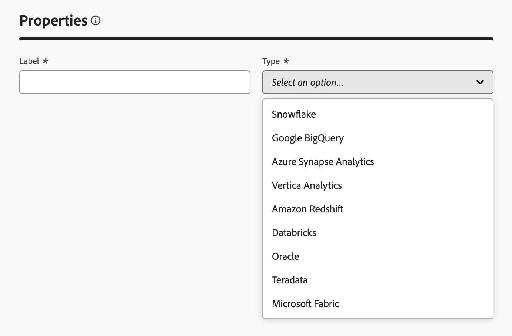

# Criar conexões {#connections-fdb}

>[!AVAILABILITY]
>
>Para acessar conexões, você precisará de uma das seguintes permissões:
>
>-**Gerenciar Banco de Dados Federado**
>-**Exibir Banco de Dados Federado**
>
>Para mais informações sobre as permissões exigidas, leia o [guia de controle de acesso](/help/governance-privacy-security/access-control.md).

A Composição de público-alvo federado do Experience Platform permite criar e enriquecer públicos-alvo de data warehouses de terceiros e importar os públicos-alvo para o Adobe Experience Platform.

## Bancos de dados compatíveis {#supported-databases}

Para trabalhar com o banco de dados federado e o Adobe Experience Platform, primeiro é necessário estabelecer uma conexão entre as duas fontes. Com a Federated Audience Composition, você pode se conectar aos seguintes bancos de dados.

* Amazon Redshift
* Azure Synapse Analytics
* Databricks
* Google BigQuery
* Microsoft Fabric
* Oracle
* Snowflake
* Vertica Analytics

## Criar conexão {#create}

Para criar uma conexão, selecione **[!UICONTROL Federated databases]** na seção Federated data.

{zoomable="yes" width="70%" align="center"}

A seção Federated databases é exibida. Selecione **[!UICONTROL Adicionar banco de dados federado]** para criar uma conexão.

{zoomable="yes" width="70%" align="center"}

O popover de propriedades da conexão é exibido. Você pode nomear sua conexão e selecionar o tipo de banco de dados que deseja criar.

{zoomable="yes" width="70%" align="center"}

Após selecionar um tipo, a seção **[!UICONTROL Detalhes]** é exibida. Esta seção difere com base no tipo de banco de dados escolhido anteriormente.

>[!BEGINTABS]

>[!TAB Amazon Redshift]

>[!AVAILABILITY]
>
>Somente o Amazon Redshift AWS, o Amazon Redshift Spectrum e o Amazon Redshift Serverless são suportados.
>
>Além disso, o acesso seguro ao data warehouse externo do Amazon Redshift por meio de um link privado é suportado.

Depois de selecionar Amazon Redshift, você pode adicionar os seguintes detalhes:

| Campo | Descrição |
| ----- | ----------- |
| Servidor | O nome da fonte de dados. |
| Conta | O nome de usuário da conta. |
| Senha | A senha da conta. |
| Banco de dados | O nome do banco de dados. Se isso for especificado no nome do servidor, esse campo poderá ser deixado em branco. |
| Esquema de trabalho | O nome do esquema do banco de dados a ser usado para tabelas de trabalho. Mais informações sobre este recurso podem ser encontradas na [documentação sobre esquemas do Amazon](https://docs.aws.amazon.com/redshift/latest/dg/r_Schemas_and_tables.html){target="_blank"}.  **Observação:** você pode usar qualquer esquema do banco de dados, incluindo esquemas usados para processamento temporário de dados, desde que tenha as permissões necessárias para se conectar a este esquema. No entanto, você **deve** usar esquemas de trabalho distintos ao conectar várias sandboxes com o mesmo banco de dados. |

>[!TAB Azure Synapse Analytics]

>[!NOTE]
>
>Se você quiser criar uma conexão segura usando o Azure Synapse Analytics, entre em contato com o representante do Atendimento ao cliente da Adobe.

Depois de selecionar o Azure Synapse Analytics, você pode adicionar os seguintes detalhes:

| Campo | Descrição |
| ----- | ----------- |
| Servidor | O URL do servidor Azure Synapse. |
| Conta | O nome de usuário da conta do Azure Synapse. |
| Senha | A senha da conta do Azure Synapse. |
| Banco de dados | O nome do banco de dados. Se isso for especificado no nome do servidor, esse campo poderá ser deixado em branco. |
| Opções | Opções adicionais para a conexão. Para o Azure Synapse Analytics, você pode especificar o tipo de autenticação compatível com o conector. Atualmente, a Composição de Público Federado dá suporte a `ActiveDirectoryMSI`. Para obter mais informações sobre cadeias de conexão, leia a [seção de exemplos de cadeias de conexão da documentação da Microsoft](https://learn.microsoft.com/pt-br/sql/connect/odbc/using-azure-active-directory?view=sql-server-ver15#example-connection-strings){target="_blank"}. |

>[!TAB Databricks]

>[!NOTE]
>
>Há suporte para o acesso seguro ao data warehouse externo do Databricks por meio de link privado. Isso inclui conexões seguras com bancos de dados do Databricks hospedados no Amazon Web Services (AWS) por meio de link privado e bancos de dados do Databricks hospedados no Microsoft Azure via VPN. Entre em contato com o representante da Adobe para obter assistência na configuração do acesso seguro.

Depois de selecionar Databricks, você pode adicionar os seguintes detalhes:

| Campo | Descrição |
| ----- | ----------- |
| Servidor | O nome do servidor Databricks. |
| Caminho HTTP | O caminho para o Cluster ou Warehouse. Para obter mais informações sobre o caminho, leia a [documentação do Databricks sobre detalhes de conexão](https://docs.databricks.com/aws/en/integrations/compute-details){target="_blank"}. |
| Senha | O token de acesso para o servidor Databricks. Para obter mais informações sobre esse valor, leia a [documentação de Databricks sobre tokens de acesso pessoal](https://docs.databricks.com/aws/en/dev-tools/auth/pat){target="_blank"}. |
| Catálogo | O nome do Catálogo de Databricks. Para obter mais informações sobre catálogos em Databricks, leia a [documentação sobre Databricks em catálogos](https://docs.databricks.com/aws/en/catalogs/){target="_blank"} |
| Esquema de trabalho | O nome do esquema de banco de dados a ser usado para as tabelas de trabalho.   **Observação:** você pode usar o esquema **any** do banco de dados, incluindo esquemas usados para processamento temporário de dados, desde que tenha as permissões necessárias para se conectar a este esquema. No entanto, você **deve** usar esquemas de trabalho distintos ao conectar várias sandboxes com o mesmo banco de dados. |
| Opções | Opções adicionais para a conexão. As opções disponíveis estão listadas na tabela a seguir. |

Para Databricks, você pode definir as seguintes opções adicionais:

| Opções | Descrição |
| ------- | ----------- |
| TimeZoneName | O nome do fuso horário a ser usado. Este valor representa o parâmetro de sessão `TIMEZONE`. Para obter mais informações sobre fusos horários, leia a [documentação de Databricks sobre fusos horários](https://docs.databricks.com/aws/en/sql/language-manual/parameters/timezone#:~:text=The%20system%20default%20is%20UTC%20.){target="_blank"}. |

>[!TAB Google BigQuery]

>[!NOTE]
>
>O acesso seguro ao data warehouse externo do Google BigQuery por meio de VPN é compatível.

Depois de selecionar o Google BigQuery, você pode escolher qual método de autenticação deseja usar ao se conectar com a Federated Audience Composition.

Se você selecionar **[!UICONTROL Conta/Autenticação de senha]**, poderá adicionar as seguintes informações de logon:

| Campo | Descrição |
| ----- | ----------- |
| Conta de serviço | O endereço de email da sua conta de serviço. Para obter mais informações, leia a [documentação da conta do Google Cloud Service](https://cloud.google.com/iam/docs/service-accounts-create){target="_blank"}. |

Se você selecionar **[!UICONTROL OAuth 2.0]**, será possível adicionar as seguintes informações de logon:

>[!NOTE]
>
>Antes de se conectar ao Google BigQuery usando o OAuth 2.0, será necessário configurar o URL de redirecionamento no projeto do Google Cloud. Adicione a URL de redirecionamento `https://fac-oauth.adobe.io/oauth` ao seu projeto da Google Cloud na configuração da ID do cliente OAuth 2.0.

| Campo | Descrição |
| ----- | ----------- |
| ID de cliente | A ID do cliente do seu projeto do Google BigQuery. Este campo atua como um nome de usuário para o seu projeto. |
| Segredo do cliente | O segredo do cliente do seu projeto do Google BigQuery. Este campo atua como uma senha para o seu projeto. |
| Escopo de acesso | Informações pré-preenchidas que listam os escopos para os quais o token OAuth está autorizado nos recursos da Google Cloud. |

Selecione **[!UICONTROL Entrar]** para concluir sua autenticação.

Depois de inserir os detalhes de logon, é possível adicionar os seguintes detalhes:

| Campo | Descrição |
| ----- | ----------- |
| Projeto | A ID do seu projeto. Para obter mais informações, leia a [documentação do projeto do Google Cloud](https://cloud.google.com/resource-manager/docs/creating-managing-projects){target="_blank"}. |
| Conjunto de dados | O nome do conjunto de dados. Para obter mais informações, leia a [documentação do conjunto de dados da Google Cloud](https://cloud.google.com/bigquery/docs/datasets-intro){target="_blank"}. |
| Caminho do arquivo de chave | O arquivo de chave para o servidor. Somente `json` arquivos são suportados. |
| Opções | Opções adicionais para a conexão. As opções disponíveis estão listadas na tabela a seguir. |

Para o Google BigQuery, você pode definir as seguintes opções adicionais:

| Opções | Descrição |
| ------- | ----------- |
| ProxyType | O tipo de proxy usado para se conectar ao BigQuery. Os valores suportados incluem `HTTP`, `http_no_tunnel`, `socks4` e `socks5`. |
| ProxyHost | O hostname ou endereço IP onde o proxy pode ser alcançado. |
| ProxyUid | O número da porta em que o proxy está sendo executado. |
| ProxyPwd | A senha do proxy. |
| bgpath | **Observação:** aplicável somente para a **ferramenta de carregamento em massa** (Cloud SDK).    O caminho para o diretório bin do Cloud SDK no servidor. Você só precisa definir isso se tiver movido o diretório `google-cloud-sdk` para outro local ou se não quiser usar a variável PATH. |
| GCloudConfigName | **Observação:** isso só é aplicável para a **ferramenta de carregamento em massa** (Cloud SDK) acima da versão 7.3.4.    O nome da configuração que armazena os parâmetros para carregar os dados. Por padrão, este valor é `accfda`. |
| GCloudDefaultConfigName | **Observação:** isso só é aplicável para a **ferramenta de carregamento em massa** (Cloud SDK) acima da versão 7.3.4.    O nome da configuração temporária para recriar a configuração principal para carregar dados. Por padrão, este valor é `default`. |
| GCloudRecreateConfig | **Observação:** isso só é aplicável para a **ferramenta de carregamento em massa** (Cloud SDK) acima da versão 7.3.4.    Um valor booliano que permite decidir se o mecanismo de carregamento em massa deve recriar, excluir ou modificar automaticamente as configurações do Google Cloud SDK. Se esse valor estiver definido como `false`, o mecanismo de carregamento em massa carregará dados usando uma configuração existente na máquina. Se esse valor estiver definido como `true`, verifique se a configuração está definida corretamente; caso contrário, o erro `No active configuration found. Please either create it manually or remove the GCloudRecreateConfig option` será exibido e o mecanismo de carregamento será revertido para o mecanismo de carregamento padrão. |

>[!TAB Malha do Microsoft]

Depois de selecionar o Microsoft Fabric, você pode adicionar os seguintes detalhes:

| Campo | Descrição |
| ----- | ----------- |
| Servidor | O URL do servidor do Microsoft Fabric. |
| ID do aplicativo | A ID do aplicativo do Microsoft Fabric. Para obter mais informações sobre a ID do aplicativo, leia a [documentação do Microsoft Fabric sobre a configuração do aplicativo](https://learn.microsoft.com/en-us/fabric/workload-development-kit/create-entra-id-app){target="_blank"}. |
| Segredo do cliente | O segredo do cliente para o aplicativo. Para obter mais informações sobre o segredo do cliente, leia a [documentação do Microsoft Fabric sobre a configuração do aplicativo](https://learn.microsoft.com/en-us/fabric/workload-development-kit/create-entra-id-app#step-8-generate-a-secret-for-your-application){target="_blank"}. |
| Opções | Opções adicionais para a conexão. As opções disponíveis estão listadas na tabela a seguir. |

Para o Microsoft Fabric, você pode definir as seguintes opções adicionais:

| Opção | Descrição |
| ------ | ----------- |
| Autenticação | O tipo de autenticação usado pelo conector. Os valores suportados incluem: `ActiveDirectoryMSI`. Para obter mais informações, leia a [documentação do Microsoft sobre conectividade de warehouse](https://learn.microsoft.com/en-us/fabric/data-warehouse/connectivity){target="_blank"}. |

>[!TAB Oracle]

>[!NOTE]
>
>O Federated Audience Composition é compatível com a configuração de conexão federada com bancos de dados do Oracle na versão 11g ou superior e hospedado no AWS, Azure, Exadata ou em uma nuvem privada (desde que seja acessível por uma rede externa). Se você tiver mais dúvidas relacionadas à configuração do banco de dados do Oracle ou precisar criar uma conexão segura com o Oracle, entre em contato com o representante do Atendimento ao cliente da Adobe.

Depois de selecionar Oracle, você pode adicionar os seguintes detalhes:

| Campo | Descrição |
| ----- | ----------- |
| Servidor | O URL do servidor Oracle. |
| Conta | O nome de usuário da conta. |
| Senha | A senha da conta. |

>[!TAB Snowflake]

>[!NOTE]
>
>Há suporte para o acesso seguro ao data warehouse externo do Snowflake por meio de link privado. Observe que a conta do Snowflake deve estar hospedada no Amazon Web Services (AWS) ou Azure e localizada na mesma região do ambiente da Composição de público-alvo federado. Entre em contato com o representante da Adobe para obter assistência na configuração do acesso seguro à conta do Snowflake.

Depois de selecionar o Snowflake, você pode escolher qual método de autenticação deseja usar ao se conectar com a Federated Audience Composition.

Se você selecionar **[!UICONTROL Conta/Autenticação de senha]**, poderá adicionar as seguintes informações de logon:

| Campo | Descrição |
| ----- | ----------- |
| Servidor | O nome do servidor. |
| Usuário(a)  | O nome de usuário da conta. |
| Senha | A senha da conta. |

Se você selecionar **[!UICONTROL OAuth 2.0]**, será possível adicionar as seguintes informações de logon:

>[!NOTE]
>
>Antes de se conectar ao Snowflake usando o OAuth 2.0, será necessário configurar o URL de redirecionamento no objeto de integração do Snowflake OAuth. Adicione a URL de redirecionamento `https://fac-oauth.adobe.io/oauth` à sua configuração de integração do Snowflake OAuth.

| Campo | Descrição |
| ----- | ----------- |
| Servidor | O nome do servidor. |
| ID de cliente | A ID do cliente do seu projeto do Snowflake. Este campo atua como um nome de usuário para o seu projeto. |
| Segredo do cliente | O segredo do cliente do seu projeto do Snowflake. Este campo atua como uma senha para o seu projeto. |

Selecione **[!UICONTROL Entrar]** para concluir sua autenticação.

Depois de inserir os detalhes de logon, é possível adicionar os seguintes detalhes:

| Campo | Descrição |
| ----- | ----------- |
| Banco de dados | O nome do banco de dados. Se isso for especificado no nome do servidor, esse campo poderá ser deixado em branco. |
| Esquema de trabalho | O nome do esquema de banco de dados a ser usado para as tabelas de trabalho.   **Observação:** você pode usar o esquema **any** do banco de dados, incluindo esquemas usados para processamento temporário de dados, desde que tenha as permissões necessárias para se conectar a este esquema. No entanto, você **deve** usar esquemas de trabalho distintos ao conectar várias sandboxes com o mesmo banco de dados. |
| Chave privada | A chave privada da conexão de banco de dados. Você pode carregar um arquivo `.pem` do seu sistema local. |
| Opções | Opções adicionais para a conexão. As opções disponíveis estão listadas na tabela a seguir. |

Para o Snowflake, você pode definir as seguintes opções adicionais:

| Opções | Descrição |
| ------- | ----------- |
| esquema de trabalho | O nome do esquema de banco de dados a ser usado para tabelas de trabalho. |
| TimeZoneName | O nome do fuso horário a ser usado. Este valor representa o parâmetro de sessão `TIMEZONE`. Por padrão, o fuso horário do sistema será usado. Para obter mais informações sobre fusos horários, leia a [documentação do Snowflake sobre fusos horários](https://docs.snowflake.com/en/sql-reference/parameters#timezone){target="_blank"}. |
| WeekStart | O dia em que você deseja que a semana comece. Este valor representa o parâmetro de sessão `WEEK_START`. Para obter mais informações sobre o início da semana, leia a [documentação do Snowflake sobre o parâmetro de início da semana](https://docs.snowflake.com/en/sql-reference/parameters#week-start){target="_blank"} |
| UseCachedResult | Um booleano que determina se os resultados em cache do Snowflake serão usados. Este valor representa o parâmetro de sessão `USE_CACHED_RESULTS`. Por padrão, esse valor está definido como verdadeiro. Para obter mais informações sobre esse parâmetro, leia a [documentação do Snowflake sobre resultados persistentes](https://docs.snowflake.com/en/user-guide/querying-persisted-results){target="_blank"}. |
| bulkThreads | O número de threads a serem usados para o carregador em massa do Snowflake. Quanto mais threads forem adicionados, melhor será o desempenho para cargas em massa maiores. Por padrão, esse valor é definido como 1. |
| chunkSize | O tamanho do arquivo de cada parte do carregador em massa. Quando usado simultaneamente com mais threads, você pode melhorar o desempenho de seus carregamentos em massa. Por padrão, esse valor é definido como 128 MB. Para obter mais informações sobre tamanhos de partes, leia a [documentação do Snowflake sobre preparação de arquivos de dados](https://docs.snowflake.com/en/user-guide/data-load-considerations-prepare){target="_blank"}. |
| StageName | O nome de um ambiente de preparo interno pré-provisionado. Isso pode ser usado em carregamentos em massa em vez de criar um novo estágio temporário. |

>[!TAB Vertica Analytics]

Depois de selecionar Vertica Analytics, você pode adicionar os seguintes detalhes:

| Campo | Descrição |
| ----- | ----------- |
| Servidor | O URL do servidor Vertica Analytics. |
| Conta | O nome de usuário da conta. |
| Senha | A senha da conta. |
| Banco de dados | O nome do banco de dados. Se isso for especificado no nome do servidor, esse campo poderá ser deixado em branco. |
| Esquema de trabalho | O nome do esquema de banco de dados a ser usado para as tabelas de trabalho.   **Observação:** você pode usar o esquema **any** do banco de dados, incluindo esquemas usados para processamento temporário de dados, desde que tenha as permissões necessárias para se conectar a este esquema. No entanto, você **deve** usar esquemas de trabalho distintos ao conectar várias sandboxes com o mesmo banco de dados. |
| Opções | Opções adicionais para a conexão. As opções disponíveis estão listadas na tabela a seguir. |

Para o Vertica Analytics, você pode definir as seguintes opções adicionais:

| Opções | Descrição |
| ------- | ----------- |
| TimeZoneName | O nome do fuso horário a ser usado. Este valor representa o parâmetro de sessão `TIMEZONE`. Para obter mais informações sobre fusos horários, leia a [documentação do Vertica Analytics sobre fusos horários](https://docs.vertica.com/24.1.x/en/admin/configuring-db/config-procedure/using-time-zones-with/){target="_blank"} |

>[!ENDTABS]

Depois de adicionar os detalhes da conexão, observe as seguintes configurações adicionais:

>[!NOTE]
>
>Para usar a Federated Audience Composition para um determinado banco de dados, você deve lista de permissões **todos** os endereços IP associados a esse banco de dados.

| Configurações | Detalhes |
| -------- | ------- |
| Habilitar conexão | Um botão booleano que determina se a conexão será ativada automaticamente. |
| IPs do servidor | Incluir na lista de permissões Um popover que exibe quais endereços IP precisam ser resolvidos para se conectar ao banco de dados. |
| Testar conexão | Permite verificar os detalhes da configuração. |

Agora você pode selecionar **[!UICONTROL Implantar funções]**, seguido de **[!UICONTROL Adicionar]** para finalizar a conexão entre o banco de dados federado e o Experience Platform.

