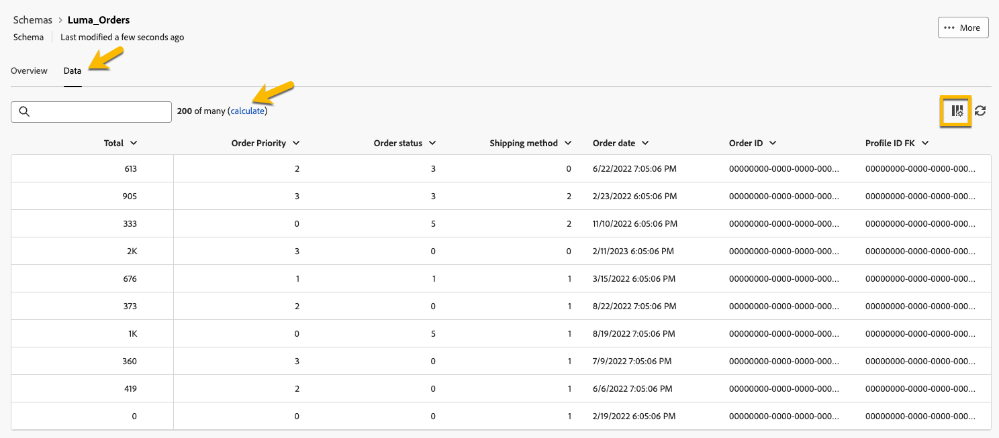

# Introdução a esquemas {#schemas}

>[!CONTEXTUALHELP]
>id="dc_schema_create_select_tables"
>title="Selecionar tabelas"
>abstract="Selecione as tabelas a serem adicionadas para o modelo de dados."

>[!CONTEXTUALHELP]
>id="dc_schema_create_key"
>title="Chave"
>abstract="Selecione uma chave para reconciliação de dados."

>[!CONTEXTUALHELP]
>id="dc_schema_create_schema_name"
>title="Nome do esquema"
>abstract="Insira o nome do esquema."

>[!CONTEXTUALHELP]
>id="dc_schema_edit_description"
>title="Descrição do esquema"
>abstract="A descrição do esquema lista colunas, tipos e rótulos. Você também pode verificar a chave de reconciliação do esquema. Para atualizar a definição do esquema, clique no ícone de lápis."

>[!CONTEXTUALHELP]
>id="dc_schema_filter_sources"
>title="Selecione o banco de dados de origem a ser filtrado"
>abstract="Você pode filtrar os esquemas com base em sua origem. Selecione um ou vários Bancos de dados federados para exibir seus esquemas."

## O que é um esquema {#schema-start}

Um schema é uma representação de uma tabela do banco de dados. É um objeto dentro do aplicativo que define como os dados são vinculados às tabelas do banco de dados.

Ao criar um esquema, você pode definir uma representação da tabela na Composição do público-alvo federado do Experience Platform:

* Dê a ele um nome e uma descrição amigáveis para simplificar a compreensão do usuário
* Decidir a visibilidade de cada campo, de acordo com seu uso real
* Selecione sua chave primária para vincular esquemas entre elas, conforme necessário no [modelo de dados](../data-management/gs-models.md#data-model-start)

>[!CAUTION]
>
>Ao conectar várias sandboxes com o mesmo banco de dados, você deve usar esquemas de trabalho distintos.
>

## Criar um esquema {#schema-create}

Para criar esquemas na Composição de público federado, siga as etapas abaixo:

1. Na seção **[!UICONTROL Dados Federados]**, acesse o menu **[!UICONTROL Modelos]**. Navegue até a guia **[!UICONTROL Esquema]** e clique em **[!UICONTROL Criar esquema]**.

   {zoomable="yes"}

   Essa etapa permite acessar uma nova tela com uma lista suspensa onde você pode encontrar os bancos de dados conectados ao seu ambiente. Saiba mais sobre conexão de banco de dados em [esta seção](../connections/connections.md#connections-fdb).

1. Selecione o banco de dados de origem na lista e clique em **[!UICONTROL Avançar]**.

   {zoomable="yes"}

   Você poderá ver a lista de todas as tabelas no banco de dados.

1. Selecione as tabelas para as quais deseja criar o esquema.

1. Cada tabela selecionada gera um esquema com as colunas escolhidas. Configure o esquema e suas colunas conforme necessário.

   {zoomable="yes"}

   Para cada tabela, é possível:

   * alterar o rótulo do schema
   * adicionar uma descrição
   * renomear todos os rótulos de campo e definir sua visibilidade
   * selecionar a chave primária do esquema

   O schema pode ser definido da seguinte maneira:

   

1. Após concluir sua configuração, clique em **[!UICONTROL Concluído]**.

## Editar um esquema {#schema-edit}

Para editar um esquema, siga estas etapas:

1. Acesse o esquema criado anteriormente.

1. Clique no botão **[!UICONTROL Editar]**.

   {zoomable="yes"}

1. Na janela **[!UICONTROL Editar esquema]**, você pode acessar e configurar as mesmas opções de quando [criar um esquema](#schema-create).

   {zoomable="yes"}

## Visualizar dados em um esquema {#schema-preview}

Para visualizar os dados na tabela representada pelo seu esquema, navegue até a guia **[!UICONTROL Dados]**, conforme abaixo.

Clique no link **[!UICONTROL Calcular]** para visualizar o número total de gravações.

{zoomable="yes"}

Clique no botão **[!UICONTROL Configurar colunas]** para alterar a exibição de dados.

{zoomable="yes"}

## Atualizar um esquema {#schema-refresh}

As tabelas em um banco de dados federado podem ser atualizadas, adicionadas ou removidas. Nesses casos, você deve atualizar o esquema no Adobe Experience Platform para alinhar-se às alterações mais recentes. Para fazer isso, clique nos três pontos ao lado do nome do esquema a ser atualizado e selecione **Atualizar esquema**.

Também é possível atualizar a definição do schema ao editá-lo.

{zoomable="yes"}

## Excluir um esquema {#schema-delete}

Para excluir um esquema, clique no botão **[!UICONTROL Mais]** e escolha **[!UICONTROL Excluir]**.

{zoomable="yes"}
