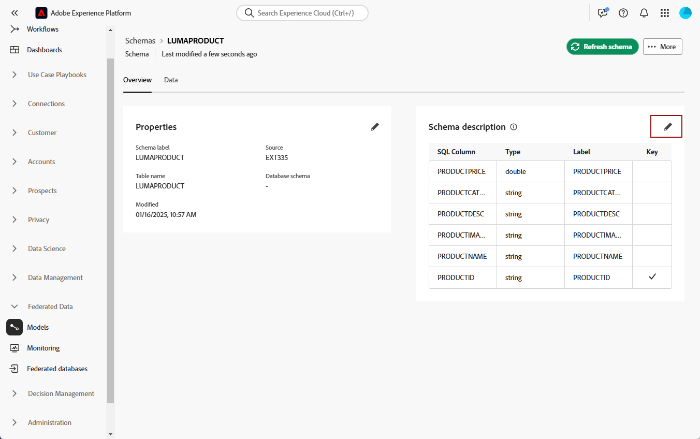

# Introdução a esquemas {#schemas}

>[!CONTEXTUALHELP]
>id="dc_schema_create_select_tables"
>title="Selecionar tabelas"
>abstract="Selecione as tabelas a serem adicionadas para o modelo de dados."

>[!CONTEXTUALHELP]
>id="dc_schema_create_key"
>title="Chave"
>abstract="Selecione uma chave para reconciliação de dados."

>[!CONTEXTUALHELP]
>id="dc_schema_create_schema_name"
>title="Nome do esquema"
>abstract="Insira o nome do esquema."

>[!CONTEXTUALHELP]
>id="dc_schema_edit_description"
>title="Descrição do esquema"
>abstract="A descrição do esquema lista colunas, tipos e rótulos. Você também pode verificar a chave de reconciliação do esquema. Para atualizar a definição do esquema, clique no ícone de lápis."

>[!CONTEXTUALHELP]
>id="dc_schema_filter_sources"
>title="Selecione o banco de dados de origem a ser filtrado"
>abstract="Você pode filtrar os esquemas com base em sua origem. Selecione um ou vários Bancos de dados federados para exibir seus esquemas."

## O que é um esquema? {#schema-start}

Um schema é uma representação de uma tabela do banco de dados. É um objeto dentro do aplicativo que define como os dados são vinculados às tabelas do banco de dados.

Ao criar um schema, você terá a possibilidade de manipular sua tabela no FAC :
- Dê a ele um nome e uma descrição amigáveis para simplificar a compreensão do usuário
- Decidir a visibilidade de cada campo, de acordo com seu uso real
- Selecione sua chave primária para vincular esquemas entre elas, conforme necessário no [modelo de dados](../data-management/gs-models.md#data-model-start)

## Criar um esquema {#schema-create}

Para criar schemas no FAC, siga as etapas abaixo:
Na seção **[!UICONTROL DADOS FEDERADOS]**, acesse o link **[!UICONTROL Modelos]**. Você encontrará a guia **[!UICONTROL Esquema]**.
Clique no botão **[!UICONTROL Criar esquema]**.

{zoomable="yes"}

Você terá acesso a uma nova interface com uma lista suspensa na qual encontrará
todos os bancos de dados conectados ao seu aplicativo. Saiba mais sobre [conexão de banco de dados](../connections/connections.md#connections-fdb).
Selecione o banco de dados de origem na lista e clique na guia **[!UICONTROL Adicionar tabelas]**

{zoomable="yes"}

Você terá acesso à lista de todas as tabelas no banco de dados.

Ao adicionar as tabelas para as quais deseja criar o esquema, você terá acesso aos campos conforme abaixo.

{zoomable="yes"}

Para cada tabela, você pode:
- renomear o rótulo do esquema fornecido
- adicionar uma descrição
- renomear todos os campos e decidir sua visibilidade.
- selecionar a chave primária do esquema

Por exemplo, esta é uma tabela importada, logo após a adição :

{zoomable="yes"}

O esquema pode ser definido assim:

{zoomable="yes"}

## Editar um esquema {#schema-edit}

Para editar um esquema, clique no nome do seu esquema na pasta schemas. Você terá acesso à página abaixo.
Clique no botão **[!UICONTROL Editar]**.

{zoomable="yes"}

Você terá acesso à mesma possibilidade de ao criar o schema:
- renomear o rótulo do esquema fornecido
- adicionar uma descrição
- renomear todos os campos e decidir sua visibilidade.
- selecionar a chave primária do esquema

{zoomable="yes"}

## Visualizar dados em um esquema {#schema-preview}

Para visualizar os dados na tabela representada pelo esquema, vá para a guia **[!UICONTROL Dados]**, conforme abaixo.
Você pode ter o número total de gravações clicando no link **[!UICONTROL Calcular]**.

{zoomable="yes"}

Você pode alterar a Visão geral dos dados clicando no botão **[!UICONTROL Configurar colunas]**.

{zoomable="yes"}

## Excluir um esquema {#schema-delete}

Para excluir um esquema, clique no botão **[!UICONTROL Mais]** e depois **[!UICONTROL Excluir]**.

{zoomable="yes"}