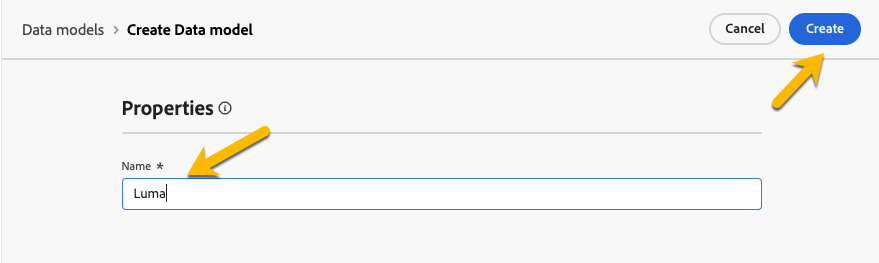

# Introdução a modelos de dados {#data-model}

>[!CONTEXTUALHELP]
>id="dc_model_menu"
>title="Trabalhar com modelos"
>abstract="Esquemas e modelos de dados são listas nesta tela. Você pode criar esquemas e modelos de dados a partir do botão **Criar**."

>[!CONTEXTUALHELP]
>id="dc_datamodel_add_schema"
>title="Selecionar esquemas"
>abstract="Selecione os esquemas para o modelo de dados."

>[!CONTEXTUALHELP]
>id="dc_datamodel_add_audience"
>title="Selecionar um público-alvo"
>abstract="Selecione o público-alvo para o modelo de dados."

>[!CONTEXTUALHELP]
>id="dc_datamodel_properties"
>title="Propriedades do modelo de dados"
>abstract="Insira o rótulo do modelo de dados."

## O que é um modelo de dados? {#data-model-start}

Um modelo de dados é um conjunto de esquemas, públicos-alvo e links entre eles.

Saiba mais sobre [esquemas](../customer/schemas.md).

Saiba mais sobre [públicos-alvo](../customer/audiences.md).

## Criar um modelo de dados {#data-model-create}

Na seção **[!UICONTROL DADOS FEDERADOS]**, acesse o link **[!UICONTROL Modelos]**. Você encontrará lá a guia **[!UICONTROL Modelo de dados]**.

{zoomable="yes"}

Ao clicar no botão **[!UICONTROL Criar modelo de dados]**, é possível nomear seu modelo de dados e clicar no botão **[!UICONTROL Criar]**.

{zoomable="yes"}

Você acessará a janela, onde pode adicionar os esquemas, os públicos-alvo e os links do modelo de dados.

{zoomable="yes"}

{zoomable="yes"}

### Criar links {#data-model-links}

