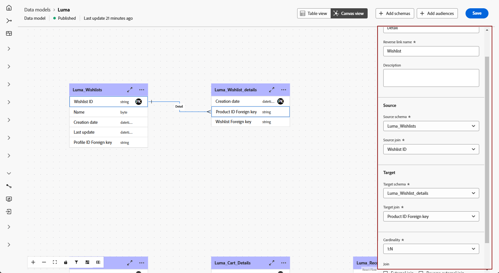

# Introdução a modelos de dados {#data-model-beta}

>[!AVAILABILITY]
>
>Para acessar modelos de dados, você precisará de uma das seguintes permissões:
>
>-**Gerenciar Modelo de Dados Federados**
>&#x200B;>-**Exibir Modelo de Dados Federados**
>
>Para mais informações sobre as permissões exigidas, leia o [guia de controle de acesso](/help/governance-privacy-security/access-control.md).

## O que é um modelo de dados {#data-model-start}

Um modelo de dados é um conjunto de esquemas, públicos-alvo e links entre eles. É usado para federar públicos-alvo com dados de bancos de dados.

Na Composição de público-alvo federado, você pode criar e gerenciar modelos de dados diretamente na exibição da Tela. Isso inclui adicionar esquemas e públicos-alvo, bem como definir os links entre eles com base no caso de uso.

Saiba mais sobre [esquemas](../customer/schemas.md#schema-start) e [públicos](../start/audiences.md).

Por exemplo, você pode ver abaixo uma representação de um modelo de dados: as tabelas com seu nome e os links entre elas.

{zoomable="yes"}

## Criar um modelo de dados {#data-model-create}

Para criar um modelo de dados, siga estas etapas:

1. Na seção **[!UICONTROL Dados Federados]**, acesse o menu **[!UICONTROL Modelos]** e navegue até a guia **[!UICONTROL Modelo de Dados]**.

   Selecione o botão **[!UICONTROL Criar modelo de dados]**.

   {zoomable="yes"}

2. Defina o nome do modelo de dados e selecione o botão **[!UICONTROL Criar]**.

3. No painel do modelo de dados, selecione **[!UICONTROL Adicionar esquemas]** para escolher o esquema associado ao seu modelo de dados.

   {zoomable="yes"}

4. Além disso, você pode adicionar públicos-alvo ao seu modelo de dados. Selecione **[!UICONTROL Adicionar públicos-alvo]** para definir seus grupos-alvo.

   {zoomable="yes"}

5. Estabeleça conexões entre tabelas em seu modelo de dados para garantir relações de dados precisas. Para obter mais informações, leia a [seção criar links](#data-model-links).

6. Após concluir a configuração, selecione **[!UICONTROL Salvar]** para aplicar as alterações.

## Criar links {#data-model-links}

>[!NOTE]
>
>Se estiver criando um link com várias associações, você só poderá usar a mesma combinação de esquemas de origem e destino uma vez.

>[!BEGINTABS]

>[!TAB Modo de exibição de tabela]

Para criar links entre tabelas do seu modelo de dados na guia Exibição de tabela, siga estas etapas:

1. Selecione o ícone de  seguido de **[!UICONTROL Criar link]** ao lado de uma das tabelas, ou selecione **[!UICONTROL Criar links]** na seção **[!UICONTROL Links]**:

   {zoomable="yes"}

2. Preencha o formulário fornecido para definir o link.

   {zoomable="yes"}

   **Cardinalidade**

   * **1-N**: uma ocorrência da tabela de público-alvo pode ter várias ocorrências correspondentes da tabela de destino, mas uma ocorrência da tabela de destino pode ter, no máximo, uma ocorrência correspondente da tabela de origem.

   * **N-1**: uma ocorrência da tabela de destino pode ter várias ocorrências correspondentes da tabela de origem, mas uma ocorrência da tabela de origem pode ter, no máximo, uma ocorrência correspondente da tabela de público-alvo.

   * **1-1**: uma ocorrência da tabela de origem pode ter, no máximo, uma ocorrência correspondente da tabela de público-alvo.

   Para criar um link de join múltiplo, selecione o ícone de adição. Agora você pode criar várias associações entre os campos de esquema.

   {zoomable="yes"}

Todos os links definidos para seu modelo de dados estão listados conforme abaixo:

{zoomable="yes"}

>[!TAB Modo de exibição de tela]

Para criar links entre tabelas do seu modelo de dados na guia Exibição da tela de desenho, siga estas etapas:

1. Acesse a visualização Tela do seu modelo de dados e escolha as duas tabelas que deseja vincular

2. Selecione o botão  ao lado do Join do Source e arraste e guie a seta em direção ao Join do Target para estabelecer a conexão.

   {zoomable="yes"}

3. Preencha o formulário fornecido para definir o link e selecione **[!UICONTROL Aplicar]** depois de configurado.

   {zoomable="yes"}

   **Cardinalidade**

   * **1-N**: uma ocorrência da tabela de público-alvo pode ter várias ocorrências correspondentes da tabela de destino, mas uma ocorrência da tabela de destino pode ter, no máximo, uma ocorrência correspondente da tabela de origem.

   * **N-1**: uma ocorrência da tabela de destino pode ter várias ocorrências correspondentes da tabela de origem, mas uma ocorrência da tabela de origem pode ter, no máximo, uma ocorrência correspondente da tabela de público-alvo.

   * **1-1**: uma ocorrência da tabela de origem pode ter, no máximo, uma ocorrência correspondente da tabela de público-alvo.

4. Todos os vínculos definidos no modelo de dados são representados como setas na visualização da tela. Selecione uma seta entre duas tabelas para exibir detalhes, fazer edições ou remover o link, conforme necessário.

   {zoomable="yes"}

5. Use a barra de ferramentas para personalizar e ajustar a tela.

   

   * **[!UICONTROL Aumentar zoom]**: amplie a tela para ver mais detalhes do seu modelo de dados com mais clareza.
   * **[!UICONTROL Diminuir zoom]**: reduza o tamanho da tela para obter uma visualização mais ampla do seu modelo de dados.
   * **[!UICONTROL Ajustar exibição]**: ajuste o zoom para ajustar todos os esquemas e/ou públicos dentro da área visível.
   * **[!UICONTROL Alternar interatividade]**: habilitar ou desabilitar a interação do usuário com a tela.
   * **[!UICONTROL Filtro]**: escolha qual esquema será exibido na tela.
   * **[!UICONTROL Forçar layout automático]**: organize automaticamente esquemas e/ou públicos para uma melhor organização.

>[!ENDTABS]

## Como fazer vídeo {#data-model-video}

Saiba como criar um modelo de dados neste vídeo:

>[!VIDEO](https://video.tv.adobe.com/v/3432020)
