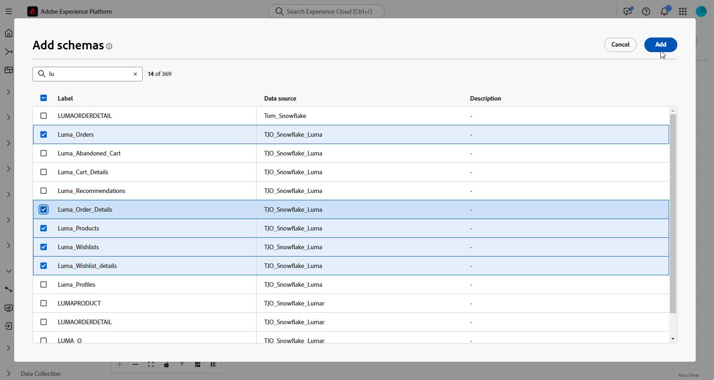

# Introdução a modelos de dados {#data-model-beta}

>[!AVAILABILITY]
>
>Para acessar modelos de dados, você precisará de uma das seguintes permissões:
>
>-**Gerenciar Modelo de Dados Federados**
>&#x200B;>-**Exibir Modelo de Dados Federados**
>
>Para obter mais informações sobre as permissões necessárias, leia o [guia de controle de acesso](/help/governance-privacy-security/access-control.md).

## O que é um modelo de dados {#data-model-start}

Um modelo de dados é um conjunto de esquemas, públicos-alvo e links entre eles. É usado para federar públicos-alvo com dados de bancos de dados.

Na Composição de público-alvo federado, você pode criar e gerenciar modelos de dados diretamente na exibição da Tela. Isso inclui adicionar esquemas e públicos-alvo, bem como definir os links entre eles com base no caso de uso.

Saiba mais sobre [esquemas](../customer/schemas.md#schema-start) e [públicos](../start/audiences.md).

Por exemplo, você pode ver abaixo uma representação de um modelo de dados: as tabelas com seu nome e os links entre elas.

{zoomable="yes"}

## Criar um modelo de dados {#data-model-create}

Para criar um modelo de dados, siga estas etapas:

1. Na seção **[!UICONTROL Dados Federados]**, acesse o menu **[!UICONTROL Modelos]** e navegue até a guia **[!UICONTROL Modelo de Dados]**.

   Clique no botão **[!UICONTROL Criar modelo de dados]**.

   {zoomable="yes"}

1. Defina o nome do seu modelo de dados e clique no botão **[!UICONTROL Criar]**.

1. No painel do modelo de dados, clique em **[!UICONTROL Adicionar esquemas]** para escolher o esquema associado ao seu modelo de dados.

   {zoomable="yes"}

1. Além disso, você pode adicionar públicos-alvo ao seu modelo de dados. Selecione **[!UICONTROL Adicionar públicos-alvo]** para definir seus grupos-alvo.

   {zoomable="yes"}

1. Estabeleça conexões entre tabelas em seu modelo de dados para garantir relações de dados precisas. [Saiba mais](#data-model-links)

1. Após concluir a configuração, clique em **[!UICONTROL Salvar]** para aplicar as alterações.

## Criar links {#data-model-links}

>[!BEGINTABS]

>[!TAB Modo de exibição de tabela]

Para criar links entre tabelas do seu modelo de dados na guia Visualização de tabela, siga estas etapas:

1. Clique no menu **[!UICONTROL Criar link]** de uma das tabelas ou clique no botão **[!UICONTROL Criar links]** e escolha as duas tabelas:

   {zoomable="yes"}

1. Preencha o formulário fornecido para definir o link.

   {zoomable="yes"}

   **Cardinalidade**

   * **1-N**: uma ocorrência da tabela de origem pode ter várias ocorrências correspondentes da tabela de destino, mas uma ocorrência da tabela de destino pode ter no máximo uma ocorrência correspondente da tabela de origem.

   * **N-1**: uma ocorrência da tabela de destino pode ter várias ocorrências correspondentes da tabela de origem, mas uma ocorrência da tabela de origem pode ter no máximo uma ocorrência correspondente da tabela de destino.

   * **1-1**: uma ocorrência da tabela de origem pode ter no máximo uma ocorrência correspondente da tabela de destino.

Todos os links definidos para seu modelo de dados estão listados abaixo:

{zoomable="yes"}

>[!TAB Modo de exibição de tela]

Para criar links entre tabelas do seu modelo de dados na guia Exibição da tela de desenho, siga estas etapas:

1. Acesse a visualização Tela do seu modelo de dados e escolha as duas tabelas que deseja vincular

1. Clique no botão  ao lado do Source Join e arraste e guie a seta em direção ao Target Join para estabelecer a conexão.

   {zoomable="yes"}

1. Preencha o formulário fornecido para definir o link e clique em **[!UICONTROL Aplicar]** depois de configurado.

   {zoomable="yes"}

   **Cardinalidade**

   * **1-N**: uma ocorrência da tabela de origem pode ter várias ocorrências correspondentes da tabela de destino, mas uma ocorrência da tabela de destino pode ter no máximo uma ocorrência correspondente da tabela de origem.

   * **N-1**: uma ocorrência da tabela de destino pode ter várias ocorrências correspondentes da tabela de origem, mas uma ocorrência da tabela de origem pode ter no máximo uma ocorrência correspondente da tabela de destino.

   * **1-1**: uma ocorrência da tabela de origem pode ter no máximo uma ocorrência correspondente da tabela de destino.

1. Todos os links definidos no modelo de dados são representados como setas na exibição da tela. Clique em uma seta entre duas tabelas para exibir detalhes, fazer edições ou remover o link, conforme necessário.

   {zoomable="yes"}

1. Use a barra de ferramentas para personalizar e ajustar a tela.

   

   * **[!UICONTROL Ampliar]**: aumente a tela para ver mais detalhes do seu modelo de dados com mais clareza.
   * **[!UICONTROL Reduzir]**: reduza o tamanho da tela para obter uma exibição mais ampla do seu modelo de dados.
   * **[!UICONTROL Ajustar exibição]**: ajuste o zoom para ajustar todos os esquemas e/ou públicos dentro da área visível.
   * **[!UICONTROL Alternar interatividade]**: habilitar ou desabilitar a interação do usuário com a tela.
   * **[!UICONTROL Filtro]**: escolha o esquema a ser exibido na tela.
   * **[!UICONTROL Forçar layout automático]**: organize automaticamente esquemas e/ou públicos para uma melhor organização.

>[!ENDTABS]

## Como fazer vídeo {#data-model-video}

Saiba como criar um modelo de dados neste vídeo:

>[!VIDEO](https://video.tv.adobe.com/v/3432020)
