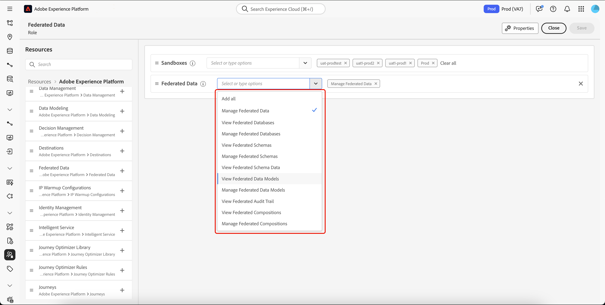

# Controle de acesso na composição de público-alvo federado

Você pode usar o controle de acesso para fornecer acesso com base em funções a sandboxes e à Federated Audience Composition.

## Gerenciar o acesso a sandboxes {#access-sandboxes}

Ao adquirir a composição de público-alvo federado da Adobe Experience Platform, um perfil do produto é criado para cada sandbox ativa no momento. Esse perfil de produto é criado no Admin Console sob o cartão de produto **Adobe Experience Platform** e segue a seguinte convenção de nomeação: `ACP_FAC - <<SandboxName>> - admin.` Para acessar a Composição de público-alvo federado de uma sandbox específica, os usuários devem ser adicionados ao perfil de produto criado para essa sandbox.

Por exemplo, se uma nova sandbox chamada “fac-test” for ativada, um perfil de produto correspondente “ACP_FAC - fac-test - admin” será criado. Para acessar a Composição de público-alvo federado com esta sandbox, os usuários precisam ser adicionados a este perfil de produto.

## Gerenciar o acesso à composição de público-alvo federado

Você pode gerenciar o acesso atribuindo as permissões necessárias para acessar diferentes aspectos da Composição do público-alvo federado. Essas permissões são atribuídas por meio de funções a usuários que precisam de acesso à **Federated Audience Composition**.

>[!NOTE]
>
>Somente administradores podem atribuir permissões a outros usuários.

1. Navegue até o menu **[!UICONTROL Permissões]**.
1. No menu **[!UICONTROL Funções]**, selecione a **[!UICONTROL Função]** que deseja atualizar.

   

1. Clique em **[!UICONTROL Editar]** para modificar as permissões da sua função.

   

1. Adicione as permissões necessárias para o usuário. Você pode adicionar as seguintes permissões para acessar a composição de público-alvo federado:

   | Permissão | Descrição |
   | ---------- | ----------- |
   | Gerenciar dados federados | Use esta permissão para gerenciar todos os aspectos da composição de público-alvo federado. Esta permissão engloba as permissões de gerenciar banco de dados federado, gerenciar esquema federado, gerenciar modelo de dados federado e gerenciar composições federadas. |
   | Gerenciar banco de dados federado | Use esta permissão para adicionar, visualizar, atualizar e excluir as suas conexões com bancos de dados federados. |
   | Visualizar banco de dados federado | Use esta permissão para visualizar as suas conexões com bancos de dados federados. |
   | Gerenciar esquema federado | Use esta permissão para criar, visualizar, atualizar, excluir e renovar esquemas. |
   | Visualizar dados do esquema federado | Use esta permissão para visualizar a guia de dados na seção de esquemas. |
   | Visualizar esquema federado | Use esta permissão para visualizar as tabelas do esquema. |
   | Gerenciar modelo de dados federado | Use esta permissão para criar, visualizar, atualizar e excluir modelos de dados. |
   | Visualizar modelo de dados federado | Use esta permissão para visualizar os modelos de dados. |
   | Visualizar trilha de auditoria da federação | Use esta permissão para visualizar a trilha de auditoria da composição de público-alvo federado. |
   | Gerenciar composições federadas | Use esta permissão para criar, visualizar, atualizar e excluir composições federadas. |
   | Visualizar composições federadas | Use esta permissão para visualizar composições federadas. |

   

1. Depois de fazer as alterações necessárias, clique em **[!UICONTROL Salvar]**.

Todos os usuários já atribuídos a essa função terão suas permissões automaticamente atualizadas e acesso à composição de público-alvo federado.

Para atribuir esta função a novos usuários:

1. Navegue até a guia **[!UICONTROL Usuários]** no painel “Função” e clique em **[!UICONTROL Adicionar usuários]**.

   

1. Insira o nome ou endereço de email do usuário, ou selecione-o na lista disponível. Depois de concluído, clique em **[!UICONTROL Salvar]**.

Alternativamente, você pode atribuir uma das funções preexistentes aos usuários, dependendo das permissões de que eles precisam. Para mais informações sobre como atribuir funções preexistentes a um usuário, leia o [guia de como gerenciar usuários para um perfil de produto](https://experienceleague.adobe.com/pt-br/docs/experience-platform/access-control/ui/users).

| Nome da função | Permissões |
| --------- | ----------- |
| Gerentes de dados da FAC | <ul><li>Gerenciar composições federadas</li><li>Visualizar bancos de dados federados</li><li>Visualizar esquemas federados</li><li>Visualizar dados do esquema federado</li><li>Visualizar modelos de dados federados</li></ul> |
| Gerentes de composição da FAC | <ul><li>Gerenciar composições federadas</li></ul> |
| Administradores da FAC | <ul><li>Gerenciar dados federados</li></ul> |

O usuário receberá um email com instruções para acessar a sua instância. Se o usuário não tiver sido criado anteriormente, consulte [esta documentação](https://experienceleague.adobe.com/pt-br/docs/experience-platform/access-control/abac/permissions-ui/users).

## Gerenciar acesso a composições específicas

Você pode gerenciar o acesso a uma composição específica aplicando rótulos de acesso.

Para obter mais informações sobre como aplicar rótulos de acesso a uma composição, leia a [seção aplicar rótulos de acesso](/help/compositions/home.md#access-labels) do guia de composições.
