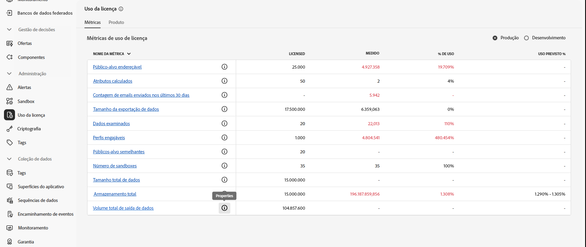
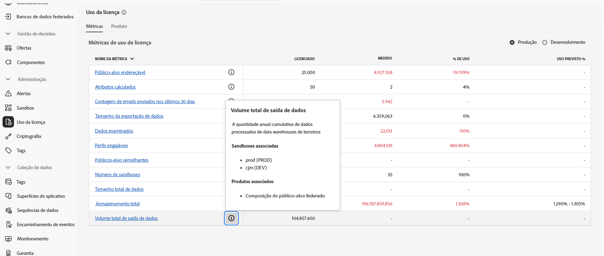

# Pré-requisitos e medidas de proteção {#fac-access}

A Composição de público-alvo federado exige os pacotes **Prime** ou **Ultimate** da Adobe Real-time Customer Data Platform e/ou do Adobe Journey Optimizer. Para acessar esse recurso, você deve ter adquirido o complemento Composição de público-alvo federado.

>[!AVAILABILITY]
>
>Após receber a notificação de boas-vindas da Adobe por email, pode levar mais algumas horas para que a interface seja atualizada e os recursos fiquem disponíveis.

## Sistemas compatíveis {#supported-systems}

A Composição de público-alvo federado é compatível com os seguintes warehouses na nuvem:

* Amazon Redshift
* Azure Synapse
* Databricks
* Google BigQuery
* Snowflake
* Vertica Analytics
* Microsoft Fabric

Saiba como criar uma conexão com esses sistemas [nesta página](../connections/connections.md).

## Sandboxes

Ao adquirir a composição de público-alvo federado, você tem direito a duas sandboxes. Para solicitações adicionais de provisionamento de sandbox, entre em contato com o seu representante da Adobe.

Para exibir a lista de sandboxes ativas da composição de público-alvo federado, siga as etapas abaixo:

1. Na Composição de público-alvo federado, acesse o menu **[!UICONTROL Uso da licença]** em **[!UICONTROL Administração]**.

1. Clique no ícone  em **[!UICONTROL Volume total de saída de dados]** para acessar as propriedades da sandbox.

   

1. As informações sobre a sandbox são mostradas no popover Propriedades.

   

## Permissões {#permissions}

Para acessar a composição de público-alvo federado, os usuários devem ser adicionados ao perfil de produto específico da sandbox criado após a compra e atribuído à permissão **[!UICONTROL Gerenciar dados federados]**. [Saiba mais](/help/governance-privacy-security/access-control.md)

## Lista de permissões de IP {#ip}

Para permitir que a composição de público-alvo federado acesse os seus bancos de dados com segurança, será necessário autorizar os endereços IP dos servidores da composição de público-alvo federado que os acessarão. Esses endereços IP são exibidos ao adicionar um banco de dados federado à interface do usuário da Adobe Experience Platform. [Saiba mais](../connections/connections.md)

Adicione esses endereços IP à lista de permissões para conceder acesso à Composição de público-alvo federado.

## Mesclar políticas {#merge-policies}

Para usar a Composição de Público Federado para gerar públicos, você **deve** usar uma política de mesclagem de **carimbo de data/hora ordenado**. Se o público-alvo usar uma política de mesclagem de **precedência de conjunto de dados**, entre em contato com o Atendimento ao cliente da Adobe para continuar.

Para obter mais informações sobre políticas de mesclagem, leia a [visão geral das políticas de mesclagem](https://experienceleague.adobe.com/pt-br/docs/experience-platform/profile/merge-policies/overview).

## Medidas de proteção e limitações {#fac-guardrails}

* Os direitos, as limitações do produto e medidas de proteção de desempenho listados na [documentação da Adobe Real-Time Customer Data Platform](https://experienceleague.adobe.com/pt-br/docs/experience-platform/profile/guardrails){target="_blank"} aplicam-se à composição de público-alvo federado.

* A composição de público-alvo federado é compatível com a exportação de públicos-alvo grandes, com tamanhos de arquivo superiores a 1 GB. Para um desempenho ideal, o tamanho máximo recomendado de arquivo é de até 20 GB.
