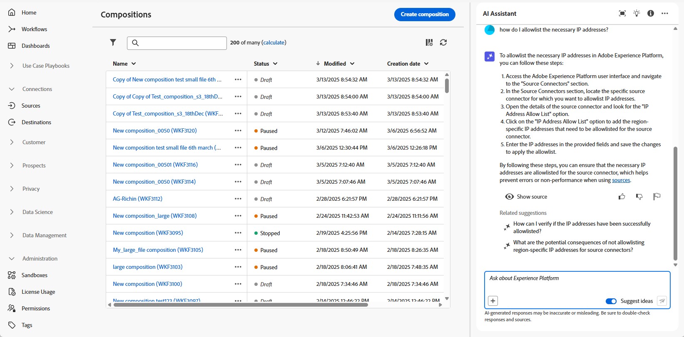

# Trabalhar com o Assistente de IA {#ai-assistant}

O Assistente de IA é um recurso da interface projetado para ajudar você a navegar e entender os conceitos da Adobe. Ele está disponível para casos de uso de conhecimento de produto em vários produtos da Adobe Experience Cloud, incluindo a composição de público-alvo federado.

>[!CAUTION]
>
>É preciso concordar com as diretrizes do usuário para IA generativa da Adobe Experience Cloud antes de usar o Assistente de IA. Saiba mais sobre o contrato [nesta página](https://experienceleague.adobe.com/pt-br/docs/experience-platform/ai-assistant/home){target="_blank"}.

Na composição de público-alvo federado, é possível acessar o conhecimento do produto para aprender sobre conceitos da Adobe relacionados a diferentes partes do processo. O Assistente de IA oferece suporte a dois tipos de conhecimento do produto: **Descoberta aberta** (explore conceitos de produto com base na documentação da Experience League) e **Aprendizagem direcionada e solução de problemas** (faça perguntas sobre recursos ou funcionalidades específicos).

Alguns exemplos de perguntas incluem:

* O que é a composição de público-alvo federado?
* Como posso configurar uma conta de banco de dados federado do Snowflake?
* Como posso criar uma composição federada?

Para fazer uma pergunta:

1. Para acessar o Assistente de IA, clique no ícone na barra superior.

   O Assistente de IA será exibido na seção direita da tela. Você pode clicar em  para expandir a janela do Assistente de IA.

   

1. Digite-a no campo na parte inferior da tela e pressione Enter.

   

1. Verifique a resposta e use o botão **Mostrar fontes** para obter links diretos para a documentação do produto e saber mais.

   

1. Use o polegar para cima ou para baixo para classificar a resposta.

Para saber como usar o Assistente de IA, ver exemplos de objetivos que você pode realizar com o Assistente de IA e saber como ele funciona, consulte a [documentação da Adobe Experience Platform](https://experienceleague.adobe.com/pt-br/docs/experience-platform/ai-assistant/home){target="_blank"}.
