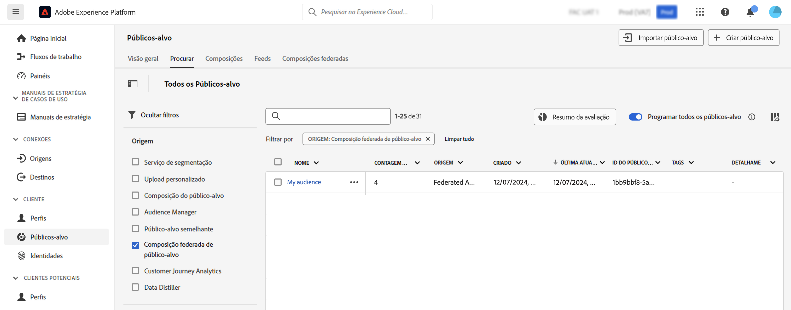

# Trabalhar com públicos-alvo {#gs-audiences}

A Composição de público-alvo federado da Experience Platform permite [criar composições](../compositions/home.md), aproveitando várias atividades em uma tela visual para criar públicos-alvo. Depois, você pode armazená-los no Portal de público-alvo da Adobe Experience Platform.

Em seguida, é possível direcionar esses públicos-alvo no Journey Optimizer ou ativá-los para qualquer destino compatível com a Adobe Experience Platform.

## Criação de público-alvo usando composições {#creation}

Para criar públicos-alvo usando a Composição de público-alvo federado, você precisa criar uma composição que inclua a atividade **[!UICONTROL Salvar público-alvo]**. Assim, é possível salvar no Portal de público-alvo e selecionar campos de seus bancos de dados externos para incluir no público-alvo. [Saiba como configurar uma atividade Salvar público-alvo](../compositions/activities.md#save-audience)

O público-alvo criado usando a Composição de dados federados da Adobe inclui todos os campos selecionados na atividade **[!UICONTROL Salvar público-alvo]** e é armazenado no Portal junto a todos os públicos-alvo da Adobe Experience Platform.

Depois de executar a composição, o público-alvo resultante é salvo na Adobe Experience Platform como um público-alvo externo e disponibilizado na Adobe Real-time Customer Data Platform e/ou no Adobe Journey Optimizer.

Você pode ativar esses públicos-alvo para qualquer destino compatível com a Adobe Experience Platform. Saiba como trabalhar com destinos na [Adobe Experience Platform](https://experienceleague.adobe.com/pt-br/docs/experience-platform/destinations/home){target="_blank"}

>[!NOTE]
>
>Os públicos-alvo criados usando a Composição de público-alvo federado da Adobe não podem ser editados. Para fazer modificações em um desses públicos-alvo, é necessário criar um novo público-alvo usando uma composição.

## Acessar seu público-alvo na Adobe Experience Platform {#access-audience}

Os públicos-alvo criados usando a Composição de público-alvo federado ficam acessíveis no Portal de público-alvo, encontrado no menu **Públicos-alvo**.

A guia **[!UICONTROL Procurar]** lista todos os públicos-alvo armazenados na Adobe Experience Platform. Você pode identificar os públicos-alvo da Composição de público-alvo federado na lista usando a coluna **[!UICONTROL Origem]** ou os filtros disponíveis no painel esquerdo.

Para obter mais informações sobre como trabalhar com públicos-alvo na Adobe Experience Platform, consulte a [documentação do Portal de público-alvo](https://experienceleague.adobe.com/pt-br/docs/experience-platform/segmentation/ui/audience-portal){target="_blank"}

<!-- add link to this donc once published: https://jira.corp.adobe.com/browse/PLAT-198674-->