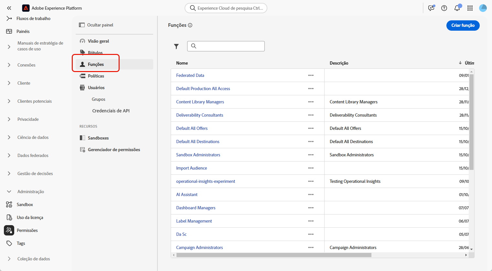
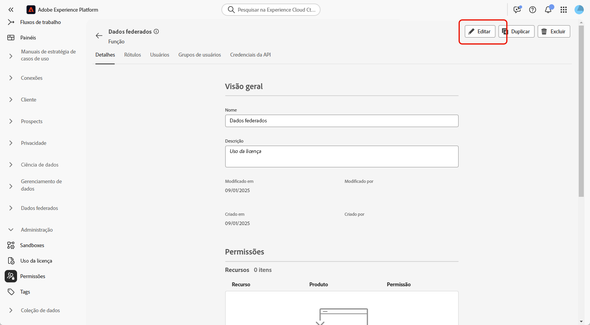
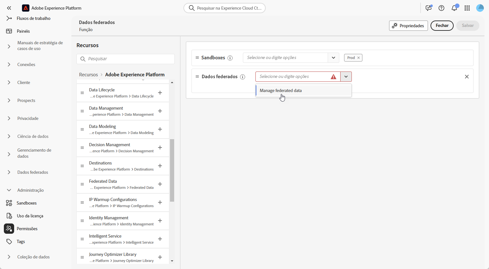
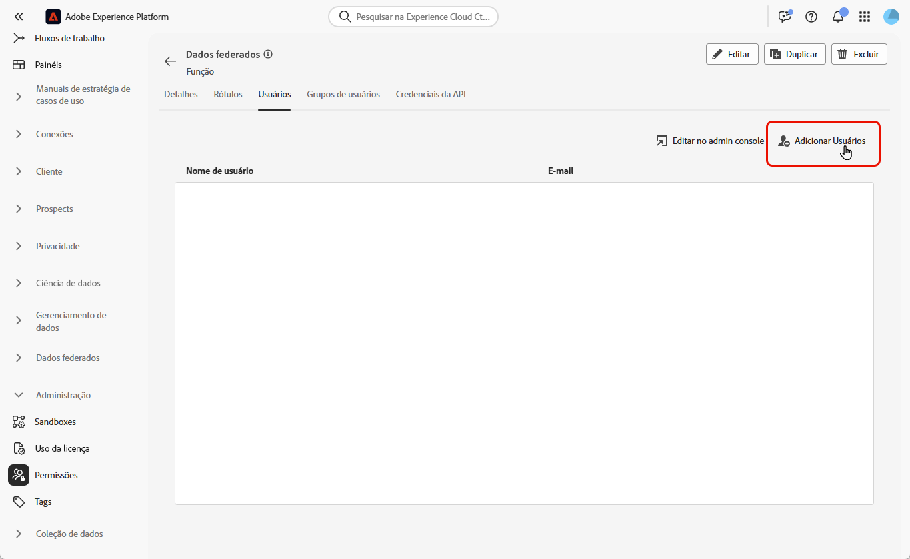

# Acessar a composição de público-alvo federado {#feature-access}

## Gerenciar o acesso a sandboxes {#access-sandboxes}

Ao adquirir a composição de público-alvo federado da Adobe Experience Platform, um perfil do produto é criado para cada sandbox ativa no momento. Esse perfil de produto é criado no Admin Console sob o cartão de produto **Adobe Experience Platform** e segue a seguinte convenção de nomeação: `ACP_FAC - <<SandboxName>> - admin.` Para acessar a Composição de público-alvo federado de uma sandbox específica, os usuários devem ser adicionados ao perfil de produto criado para essa sandbox.

Por exemplo, se uma nova sandbox chamada “fac-test” for ativada, um perfil de produto correspondente “ACP_FAC - fac-test - admin” será criado. Para acessar a Composição de público-alvo federado com esta sandbox, os usuários precisam ser adicionados a este perfil de produto.

## Gerenciar o acesso à composição de público-alvo federado

Para acessar a **Composição de público-alvo federado**, primeiro verifique se a permissão **Gerenciar dados federados** está atribuída às funções apropriadas. Essas funções devem ser atribuídas aos usuários que precisam de acesso à **Composição de público-alvo federado**.

Observe que somente administradores têm a capacidade de atribuir permissões.

1. Navegue até o menu **[!UICONTROL Permissões]**.

1. No menu **[!UICONTROL Funções]**, selecione a **[!UICONTROL Função]** que deseja atualizar.

   

1. Clique em **[!UICONTROL Editar]** para modificar as permissões da função.

   

1. Adicione o recurso dos **Dados federados** e selecione **[!UICONTROL Gerenciar dados federados]** no menu suspenso.

   

1. Depois de fazer as alterações necessárias, clique em **[!UICONTROL Salvar]**.

Todos os usuários já atribuídos a essa função terão suas permissões automaticamente atualizadas e acesso à composição de público-alvo federado.

Para atribuir esta função a novos usuários:

1. Navegue até a guia **[!UICONTROL Usuários]** no painel Função e clique em **[!UICONTROL Adicionar usuários]**.

   

1. Insira o nome ou endereço de email do usuário, ou selecione-o na lista disponível. Depois de concluído, clique em **[!UICONTROL Salvar]**.

O usuário receberá um email com instruções para acessar a sua instância. Se o usuário não tiver sido criado anteriormente, consulte [esta documentação](https://experienceleague.adobe.com/pt-br/docs/experience-platform/access-control/abac/permissions-ui/users).
