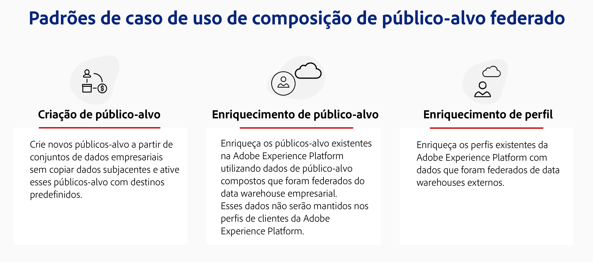
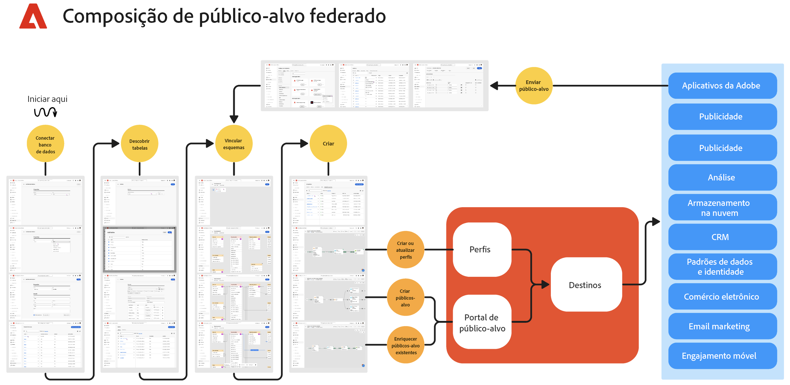

# Introdução à Composição federada de público-alvo {#gs-fac}

A Federated Audience Composition é um recurso complementar do [Adobe Real-time Customer Data Platform](https://experienceleague.adobe.com/pt-br/docs/experience-platform/segmentation/home){target="_blank"} e do [Adobe Journey Optimizer](https://experienceleague.adobe.com/pt-br/docs/journey-optimizer/using/ajo-home){target="_blank"} que permite compilar e enriquecer públicos de data warehouses de terceiros e importar os públicos para a Adobe Experience Platform. A Composição federada de público-alvo oferece uma solução fácil e eficiente para conectar o seu data warehouse corporativo diretamente à Adobe Real-time Customer Data Platform e/ou Adobe Journey Optimizer e realizar consultas nas tabelas do seu data warehouse.

A Composição federada de público-alvo da Adobe ajuda os usuários de aplicativos da Adobe Experience Platform a acessar os dados de clientes armazenados nos data warehouses e plataformas de armazenamento na nuvem, como o Amazon Redshift, o Azure Synapse Analytics entre outros. Os dados do cliente podem residir em vários data warehouses e agora podem ser acessados instantaneamente, sem replicação. As plataformas compatíveis são listadas [nesta página](../connections/federated-db.md#supported-db).

## Capacidades {#rn-capabilities}

A Federated Audience Composition amplia o valor do Real-Time CDP e do Journey Optimizer com uma abordagem abrangente para a curadoria e ativação de público:

* Amplie o acesso a conjuntos de dados críticos baseados em data warehouse para criar públicos de alto valor: utilize data warehouses existentes como o principal sistema de registro e, ao mesmo tempo, aproveite os melhores aplicativos do setor para potencializar excelentes experiências do cliente.

* Suporte abrangente para casos de uso de envolvimento avançado: a Federated Audience Composition, combinada com o Real-Time CDP ou o Journey Optimizer, oferece suporte a experiências personalizadas iniciadas pela marca com públicos federados e fornece experiências instantâneas acionadas por eventos em tempo real, combinadas com atributos de pessoa para atender aos requisitos de caso de uso em todas as equipes.

* Minimizar a movimentação e a duplicação de dados: crie públicos-alvo a partir de conjuntos de dados que residem em um data warehouse corporativo sem copiar dados subjacentes para gerenciar perfis e públicos de marketing acionáveis.

* Utilize um único sistema para fluxos de trabalho orientados por experiência: prepare públicos-alvo assimilados e federados no Adobe Experience Platform e coordene experiências de saída em todos os canais.

## Casos de uso {#rn-uc}

Por meio de uma interface amigável de marketing, crie regras de segmento que consultem o data warehouse para obter uma lista de usuários que se qualificam para um segmento específico necessário para campanhas de marketing, acesse públicos do warehouse para ativação ou enriqueça os públicos-alvo da Adobe Experience Platform com pontos de dados adicionais do warehouse.

Nesta versão, dois casos de uso estão disponíveis:

1. Criação de público-alvo: crie novos públicos-alvo a partir de conjuntos de dados corporativos sem copiar os dados subjacentes e ative-os com destinos pré-criados.&#x200B;

1. Enriquecimento de público-alvo: enriqueça os públicos-alvo existentes no Adobe Experience Platform utilizando dados de público-alvo compostos que foram federados a partir do data warehouse corporativo. Esses dados não serão mantidos nos perfis de clientes do Adobe Experience Platform.

{zoomable="yes"}{width="75%" align="center"}

## Principais etapas {#gs-steps}

A Composição federada de público-alvo da Adobe permite criar e atualizar públicos-alvo da Adobe Experience Platform diretamente do seu banco de dados, sem nenhum processo de ingestão.

{zoomable="yes"}{width="85%" align="center"}

Etapas principais:

1. **Integração de Dados**: reúna dados de várias fontes e mescle-os em um conjunto de dados unificado. Saiba como conectar aplicativos da Adobe Experience Platform a seu data warehouse corporativo, quais bancos de dados são compatíveis e como configurá-los [nesta seção](../connections/federated-db.md).

2. **Modelagem de dados**: projete e crie modelos de dados e esquemas que definam a estrutura, as relações e as restrições dos dados. Saiba mais sobre esquemas [nesta página](../customer/schemas.md). Aprenda a criar links para o modelo de dados [nesta página](../data-management/gs-models.md).

3. **Transformação de dados**: aplique técnicas de manipulação de dados para modificar o formato, a estrutura ou os valores de elementos de dados para torná-los compatíveis ou adequados para análise ou aplicativos específicos.

4. **Uso de dados**: crie, orquestre e construa públicos-alvo. Saiba como compor públicos-alvo [nesta página](../compositions/gs-compositions.md). Também é possível atualizar ou reutilizar públicos-alvo por meio do Portal de público-alvo da Adobe Experience Platform e destinos. Saiba mais [nesta página](../connections/destinations.md)

>[!NOTE]
>
>Depois de executar a composição, o público resultante é salvo na Adobe Experience Platform como um público externo e disponível no Adobe Real-time Customer Data Platform e/ou no Adobe Journey Optimizer. Ele se tornou acessível no menu **Públicos-alvo**. [Saiba mais](https://experienceleague.adobe.com/pt-br/docs/experience-platform/segmentation/ui/audience-portal){target="_blank"}

## Saiba mais {#learn}

<!-- Workflow + Workflow activities-->

Saiba como acessar a Composição, as medidas de proteção e as limitações do Federated Audience nesta [página](access-prerequisites.md).

Consulte também as perguntas frequentes em [esta página](faq.md).

>[!CONTEXTUALHELP]
>id="dc_workflow_settings_execution"
>title="Configurações de execução"
>abstract="Nesta seção, é possível definir as configurações relacionadas à execução do fluxo de trabalho, de modo que o número de dias do histórico da composição seja mantido."

>[!CONTEXTUALHELP]
>id="dc_orchestration_query_enrichment_noneditable"
>title="Atividade não editável"
>abstract="Quando uma atividade de **Consulta** ou **Enriquecimento** é configurada com dados adicionais no console, os dados de enriquecimento são levados em consideração e transmitidos para a transição de saída, mas não podem ser editados."

<!-- Create a link -->

>[!CONTEXTUALHELP]
>id="dc_federated_database_create_link"
>title="Criar um link"
>abstract="Defina as configurações do link."
